# AgileX PiPER wrist camera mount: Pi 5 + HQ Camera + Camera Module 3 Wide

Issue [#239](https://github.com/vertical-cloud-lab/byu-vcl/issues/239). A printed mount that puts a
**Raspberry Pi 5** and up to **two cameras** on the PiPER's two-finger gripper:

- a **Raspberry Pi HQ Camera** with the official 6 mm CS-mount lens, for repeatable positioning
  (the lens is bought separately; [why the 6 mm and not the 16 mm](#which-hq-lens-the-6-mm-wide-angle)), and
- a **Camera Module 3 Wide** (optional) for streaming.

It follows the OT-2 lid mount in [#234](https://github.com/vertical-cloud-lab/byu-vcl/pull/234)
(`ot2-overhead-camera/lid-mount/`): a parametric CadQuery model built around the maker's own CAD,
with interference checks, exports and renders from one script. The design notes gathered in
[borysgroup/aurora-cloud-infra#5](https://github.com/borysgroup/aurora-cloud-infra/issues/5) are
the starting point for the PiPER side. **Nothing has been printed yet.**

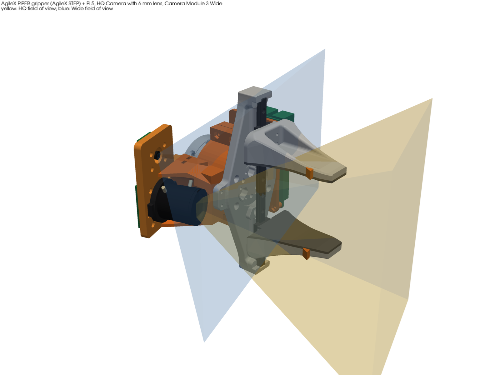

| Looking back from the fingertips (fully open) | Pi 5 side |
|---|---|
|  | 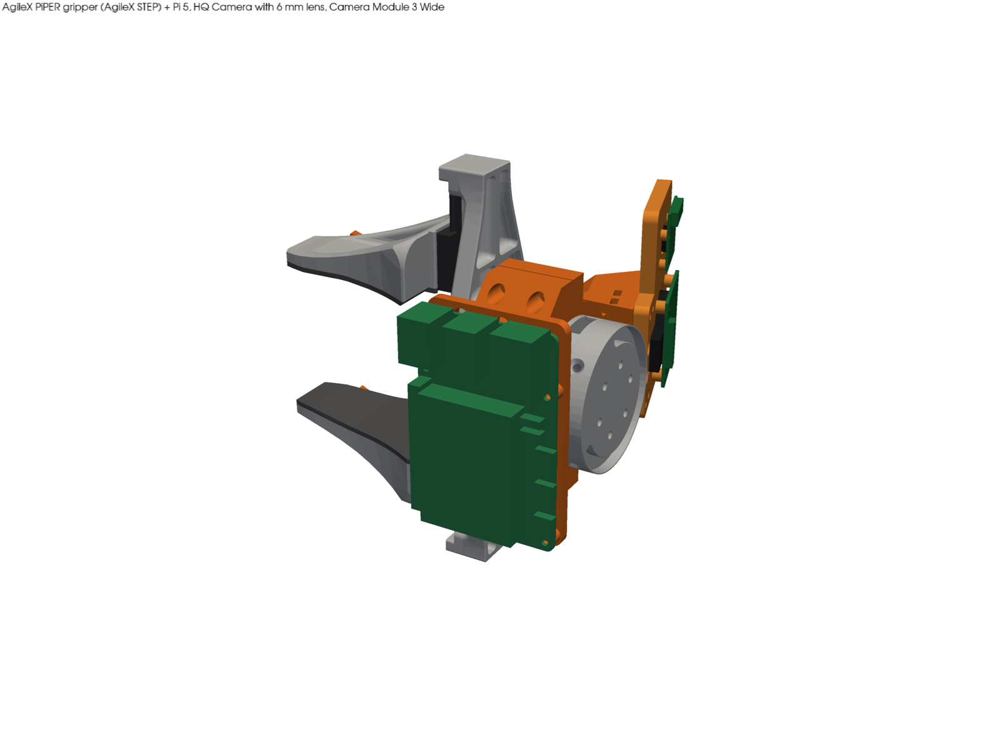 |

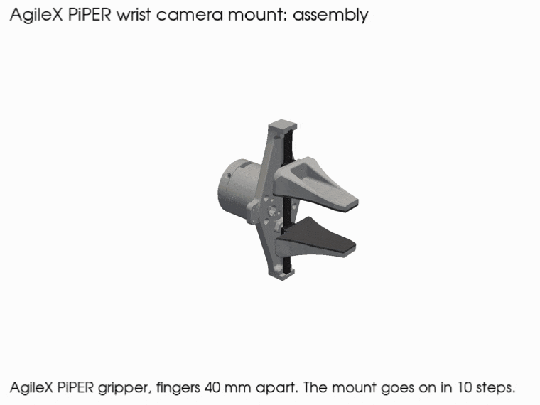

## How it attaches

AgileX's gripper STEP (fetched at run time, see below) and AgileX's own manuals and setup videos
show two features to hold on to:

1. **The finger plate's side tab**, which AgileX calls the *reserved camera mounting platform*. It
   has **two M3 brass inserts**, 12 mm apart and 6.5 mm deep, opening toward the arm (at x = -45.91,
   z = 7.92 and -4.08 in the STEP's frame, 38 mm off the axis). AgileX's own D435 wrist bracket
   bolts to it, and the gold inserts show in AgileX's 1080p setup video. Two M3 x 12 screws through
   the bracket's pad go into them. They locate the mount and stop it turning, without touching the
   screws that hold the gripper to its flange.
2. **A plain O57 mm body** from the back of the finger plate to the J6 flange (motor housing, back
   cover and flange, y = 14.5 to 65). A two-piece collar clamps round the first 31 mm of it with
   four M3 screws across the split.

The cameras hang on the tab side (-X) and the Pi 5 on the other side (+X), so the load on J6 roughly
balances. The collar joins the two halves, and the tab screws lock the whole ring against rotation.

**Nothing goes behind the J6 flange face.** The rearmost point is 64.5 mm (the Pi 5's USB-C socket)
against a flange face at 64.98. So the mount can't reach the J6 housing or link 5 at any J5 or J6
angle. From AgileX's full-arm STEP, everything behind the flange stays within about 33 mm of the J6
axis for the next 125 mm.

## The parts

| Part | What it is | Print |
|---|---|---|
| `bracket` | The pad on the tab, half the collar, and the **pod seat** (below) | Pad face down; the seat's outer face is at 45 degrees, the collar stands up |
| `pod` | The camera plate, turned 17 degrees toward the gripper axis: HQ Camera on four M2.5 bosses, Camera Module 3 Wide on four M2 bosses above it | Plate face down |
| `carrier` | The other half of the collar and a 4 mm plate for the Pi 5, with M2.5 nut traps | Pi plate face down; 45 degree gussets under the clamp ears |
| `spacers` | 4 x Pi 5 standoffs, 5 mm | Flat |
| `tag_wedge` | 2 x 35 degree wedges that turn a 5 mm AprilTag on each finger toward the HQ Camera | Base down |

None of them needs supports (see [Printing](#printing)).

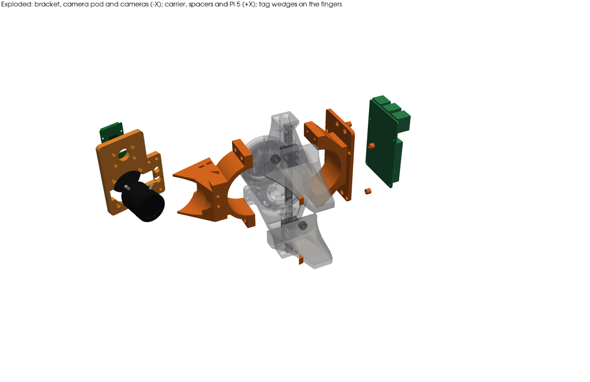

## The pod seat

The pod carries both cameras about 60 mm out from the gripper axis, so how it sits on the bracket
decides how still the cameras are. In the first version of the turned-in pod it touched the bracket
only on an 11 x 40 mm strip along its inner edge (**325 mm²**, 2 x M3), with the cameras
cantilevered about 50 mm beyond it.

Now the bracket widens outward at 45 degrees from its pad until it meets the pod's front face. The
pod sits on it from its inner edge out to the HQ lens axis, and along its top and bottom edges
either side of the lens:

- **901 mm² of contact** (2.8 times as much), measured by `piper_mount.py` (`pod_joint` in
  `checks.json`). It was 987 mm² until the cradle was widened for the lens's thumbscrews (below).
- **4 x M3 x 16**, 38 mm apart vertically and 9 mm across, into nuts dropped into slots in the
  seat's top and bottom faces. The heads are on the pod's back, clear of the HQ ribbon.
- The lens and its mount sit in a cradle cut through the seat with 1.5 mm to spare, so the pod goes
  on and off straight down its lens axis with the lens fitted. The 6 mm lens has two locking
  thumbscrews about 5 mm proud of its barrel, and focusing turns the aperture ring, so its screw can
  end up pointing anywhere. The cradle is therefore O43 from the pod to just past that screw
  (20.4 mm in front of the CS seat), and O33 round the rest of the lens. With the plain O33 cradle
  the screws would have hit the seat over about half the circle (970 mm³).
- **Neither camera sees it.** The HQ sees no printed part at all. The seat's top corner is bevelled
  along the bottom of the Wide's view, so the Wide sees no more of the bracket than it did before
  (the collar's top ear and the old web's front edge, at the bottom-left of its picture).
- The seat adds 15.5 cm³ to the bracket (36.3 to 51.8 cm³ solid).

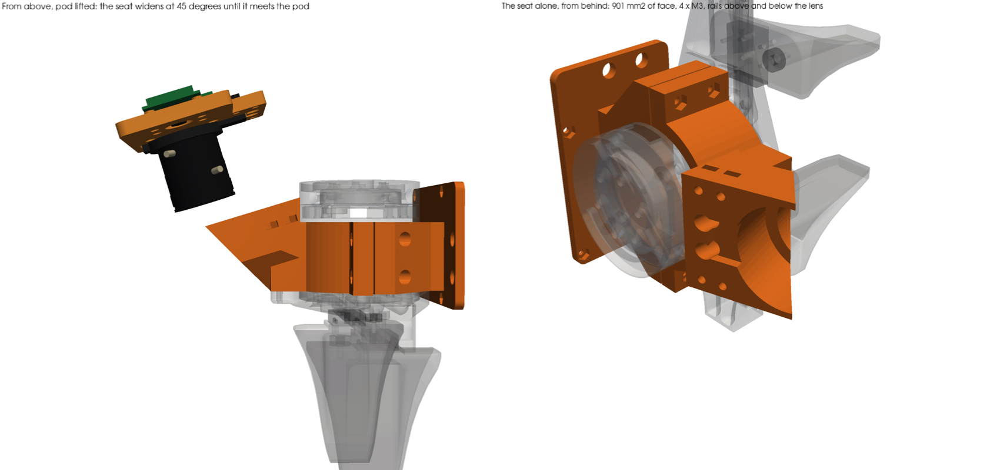

**How much stiffer, simulated.** [`sim/joint_fea.py`](sim/joint_fea.py) meshes bracket and pod
as one bonded body (quadratic tets, gmsh + scikit-fem), fixes the collar bore and the pad round the
tab screws, and loads the HQ bosses with the camera and lens (83 g) at 1 g, one direction at a time
([`sim/joint_fea.json`](sim/joint_fea.json)):

| 83 g at 1 g along | HQ moves, old → new (µm) | optical axis tilts, old → new (arcmin) | picture shifts, old → new (px) |
|---|---|---|---|
| Y (gripper pointing down) | 12.1 → 1.22 | 1.77 → 0.20 | 2.0 → 0.23 |
| Z (finger travel) | 4.2 → 1.21 | 0.16 → 0.003 | 0.18 → 0.003 |
| X | 0.64 → 0.51 | 0.018 → 0.030 | 0.02 → 0.03 |

- The worst case, along Y, is **about 9 times stiffer in tilt and 10 times in displacement**. The
  first natural frequency goes from about 110 Hz to 320 Hz (a Rayleigh-Ritz upper bound).
- Widening the lens cradle for the 6 mm lens's thumbscrews (901 mm² of seat instead of 987) cost
  about a fifth of that. Before it, the worst case was 11 and 13 times stiffer, at 360 Hz. Either way
  the picture moves less than a quarter of a pixel at 1 g.
- **These flatter the old joint.** Bonding says the joint never slips or opens, and solid PLA at
  2.4 GPa is stiffer than a 25 % infill print. The old joint's real weakness was the strip itself: a
  pod pivoting on an edge 5 mm from its two screws, where any creep in the plastic lets it rock.
  Read the table as a comparison, not as the printed part's numbers.
- **Also left out:** the camera and lens's centre of mass sits about 2 cm in front of the bosses, and
  the load is applied at the bosses, so tilt under sideways loads is understated for both designs.

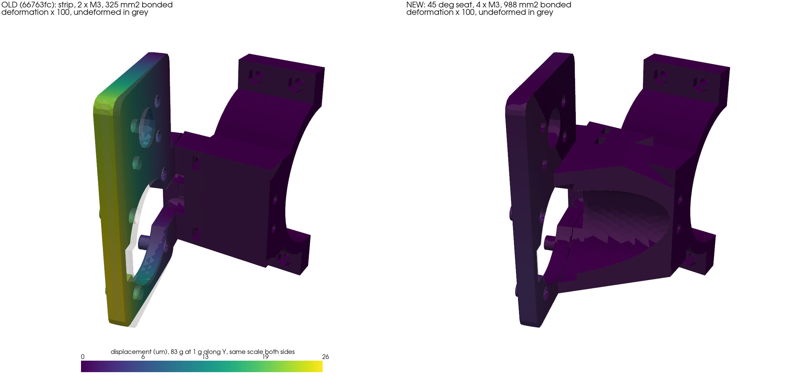

## Which HQ lens: the 6 mm wide-angle

The HQ Camera comes without a lens. Raspberry Pi sells two for it: the **6 mm wide-angle** (CS
mount) and the **16 mm telephoto** (C mount). **Buy the 6 mm.** The mount is built round it, and
[`cad/lens_compare.py`](cad/lens_compare.py) puts both on the same camera, in the same place on the
pod, to show why ([`exports/lens_compare.json`](exports/lens_compare.json)):

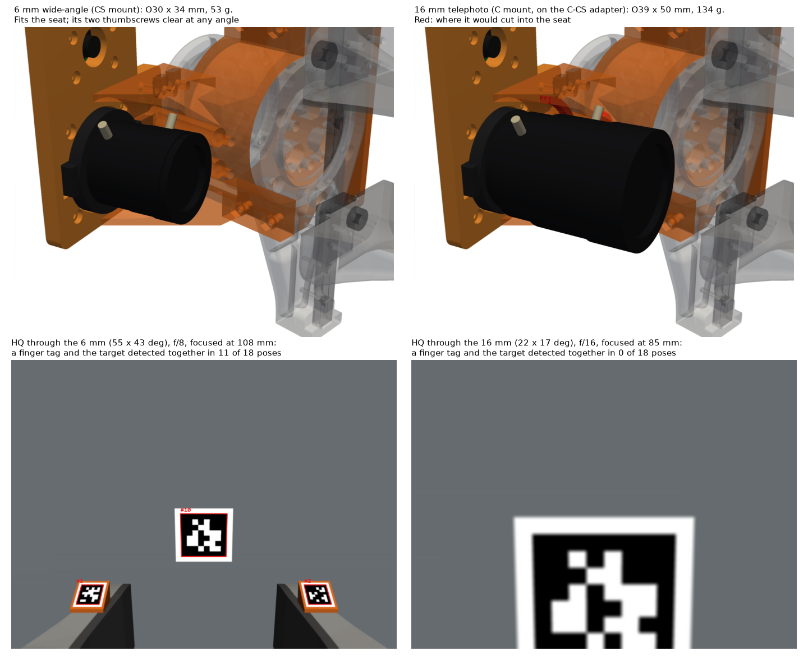

The specs are Raspberry Pi's, from the
[camera documentation](https://www.raspberrypi.com/documentation/accessories/camera.html) and its
[6 mm](https://datasheets.raspberrypi.com/hq-camera/cs-mount-lens-guide.pdf) and
[16 mm](https://datasheets.raspberrypi.com/hq-camera/c-mount-lens-guide.pdf) lens guides. The
masses are retailers' figures. Distances are measured along the camera's axis from the lens front;
pixels are in the 2028 x 1520 mode that `fiducials.py` renders.

| | 6 mm wide-angle | 16 mm telephoto |
|---|---|---|
| Mount | CS: screws straight in | C: on the C-CS adapter that comes with the HQ |
| Size, mass | O30 x 34 mm, 53 g | O39 x 50 mm plus the 5 mm adapter, 134 g |
| Field of view on the HQ | 55 x 45 degrees (71 diagonal) | 22 x 17 degrees (28 diagonal) |
| Finger tags | in view from 0 to 60 mm open, 82 mm away, about 105 px across | never in view |
| Picture size at a target 60 mm past the tips | 168 x 126 mm, 12 px/mm | 55 x 41 mm, 37 px/mm |
| A 20 mm target tag, 60 / 120 mm past the tips | 241 / 178 px across | 740 / 524 px across |
| A finger tag and the target detected in one picture, with depth-of-field blur | 11 of 18 poses | 0 of 18 |
| Sharpest it can get the finger tags and a target 60 mm out at once | f/8, focused 108 mm out: 6 px of blur at each end | f/16: 31 px |
| Rated resolution | 3 MP | 10 MP |
| On this mount | fits; the cradle clears its thumbscrews at any angle | doesn't fit (below) |
| Moment about the pod's face | 1030 g mm | 4000 g mm (3.9 times) |
| Price at launch (US retail now varies, and runs higher) | $25 | $50 |

**Why the 6 mm:**

- **It sees the gripper and the target together, which the 16 mm can't.** The camera sits 60 mm
  out from the gripper axis and 89.5 mm behind the fingertips. From there the 16 mm sees a patch 24 x
  18 mm at the depth of the finger tags, and no finger tag falls in it at any opening. Of the three
  target distances it gets a whole 20 mm target in the picture only at 120 mm past the tips, and
  never together with a finger tag.
- **Depth of field.** The work spans 82 mm (finger tags) to 161 mm (a target 60 mm out) or more.
  - **6 mm:** focused about 108 mm out at f/8, it blurs each end by about 6 px. That is about half a
    cell of a finger tag, and the detector still finds them (see below). Stopping down further
    doesn't help, because past f/8 diffraction blurs more than the extra depth of field saves.
  - **16 mm:** defocus grows with the square of the focal length, so it has about seven times as
    much over the same span. At best, at f/16, its smallest aperture, that is 31 px of blur.
  - **So the 16 mm would need refocusing by hand** between near and far, which a wrist camera can't
    do.
- **The 6 mm has enough pixels.** A 20 mm target tag is 178 to 294 px across from 30 to 120 mm past
  the tips, and AprilTag decodes from about 30 px. The 16 mm's three times the pixels per mm only pay
  off on targets much further away or on small detail. That is a job for a fixed camera, such as the
  OT-2's overhead camera, not a wrist camera.
- **The 16 mm doesn't fit this mount.**
  - With its adapter it is 21 mm longer and 9 mm wider.
  - It cuts into the seat (1663 mm³) and the finger plate (176 mm³).
  - Its front would sit 3.6 mm in front of the finger plate's front face, and it fills the bottom of
    the Wide's picture (5986 mm³ of the Wide's view, against 0.6 mm³ of a corner for the 6 mm).
  - It is 81 g heavier, with its centre of mass 10 mm further out, so the moment on the pod joint
    is 3.9 times larger.

**Using the 6 mm:**

- **Take the C-CS adapter off first.** The HQ ships with it, and the 6 mm won't focus with it on
  (Raspberry Pi's guide). Screw the HQ's back-focus ring fully in and lock it.
- **Focus about 108 mm in front of the lens, about 20 mm past the fingertips**, with the camera
  running. Following the guide, lock the inner NEAR/FAR ring with its thumbscrew, then turn the
  outer two rings together until the picture is sharp. The guide says that takes four or five whole
  turns, and it is what leaves the aperture thumbscrew pointing anywhere.
  - **Close focus:** focusing on the finger tags needs the lens 0.47 mm out from infinity, and its
    0.2 m minimum object distance only covers 0.19 mm. The guide also says the lens can focus at
    very short distances, for macro work, so it should reach. If it doesn't, back the HQ's
    back-focus ring out by about 0.3 mm.
- **Stop down to about f/8.** The aperture ring is marked only OPEN and CLOSE, so close it until a
  finger tag and a target 60 mm out are both crisp, then lock its thumbscrew. f/8 lets in an eighth
  of the light f/2.8 does, so expect longer exposures or add a small light.
- **Calibrate for distortion.** Raspberry Pi's 71 degree diagonal against 66 for a distortion-free
  6 mm lens means noticeable barrel distortion toward the corners. Calibrate the intrinsics and
  distortion once, for example with a ChArUco board and OpenCV, before trusting `solvePnP`. The
  pictures here have no distortion.
- **The thumbscrews** stand about 5 mm proud (estimated from product photos; Raspberry Pi publishes
  no drawing). The cradle clears them wherever they end up, both in place and while the pod slides
  on (see [The pod seat](#the-pod-seat)).

### Depth of field, simulated

`lens_compare.py` also re-renders each picture as the lens would take it. It blurs every pixel by
the defocus at its own distance (thin lens), then the whole picture by diffraction. Then it runs
the same detector on 18 poses: fingers 0 to 100 mm open, with the target 30, 60 or 120 mm past the
tips.

- **6 mm at f/8, focused 108 mm out:** it detects exactly what it does in the ideal pictures.
  - Both finger tags from 0 to 60 mm open.
  - The target in 17 of 18 poses, and with a finger tag in 11.
  - The worst error in the target's position, measured from a finger tag, goes from 0.61 to 0.71 mm.
- **16 mm at f/16, focused 85 mm out:** it detects the target in 6 of 18 poses, and never a finger
  tag.

Apart from the blur these are still ideal pictures, with no noise, distortion or motion blur.

## What the cameras see

| HQ Camera + 6 mm lens (55 x 43 degrees), 20 mm target 60 mm past the tips | Camera Module 3 Wide (102 x 67 degrees) |
|---|---|
| 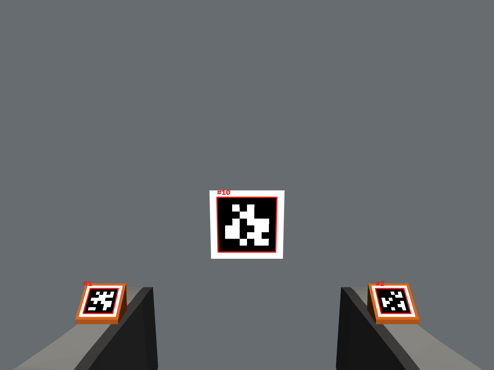 |  |

Both views are rendered in pyvista from the modelled camera positions (`fiducials.py`), with the
fingers 40 mm apart.

- **HQ Camera:** the lens front sits 89.5 mm behind the fingertips, 16.5 mm behind the finger
  plate's front face and 60 mm out from the gripper axis. Turned 17 degrees in, it has the gripper
  axis in view from the fingertips on, the fingertips at every opening up to 80 mm, and both finger
  tags from 0 to 60 mm. The fingers are at the bottom of the picture, and the finger travel runs
  along its long side.
- **Camera Module 3 Wide:** it sees the fingertips and the scene around them, which is what a
  stream needs.

**Is the 17 degree turn worth it?** For locating a fiducial on the gripper and one on the object in
the same picture, yes: it is what puts both in view. With the pod set back and not turned, the
gripper axis only comes into the HQ's view 64 mm past the fingertips, and neither the fingertips
nor the finger tags are in view at any opening. The
costs are the seat above (the pod needs real support), 10 mm more width on the camera side (below),
and a target straight ahead is seen 17 degrees off square, which the pose solve handles. A wider lens
at 0 degrees would also get the fingers in view, but with fewer pixels on the target and more
distortion.

### Fiducials

`fiducials.py` puts AprilTag 36h11 tags in the rendered HQ picture and runs OpenCV's detector and
`solvePnP` (IPPE_SQUARE) on it, from 0 to 100 mm of opening:

- **Finger tags** (#1 and #2, 5 mm) on the printed wedges, 17.5 mm behind each fingertip: detected
  from 0 to 60 mm of opening, seen 33 to 39 degrees off square (stuck flat on the finger it would be
  66 to 68), about 100 px across.
- **Target tag** (#10, 20 mm) 60 or 120 mm past the fingertips: detected at every opening. At
  30 mm past the tips, from 20 mm of opening up.
- Worst errors against the true poses: 0.76 mm and 0.98 degrees for any tag, and 1.04 mm for the
  target's position relative to a finger tag.

The pictures are ideal (no blur, noise or distortion), so these show geometry, not a real camera's
accuracy. [`exports/fiducials/tags.pdf`](exports/fiducials/tags.pdf) is the tags at exact size;
print it at 100 %.

### Tight spaces

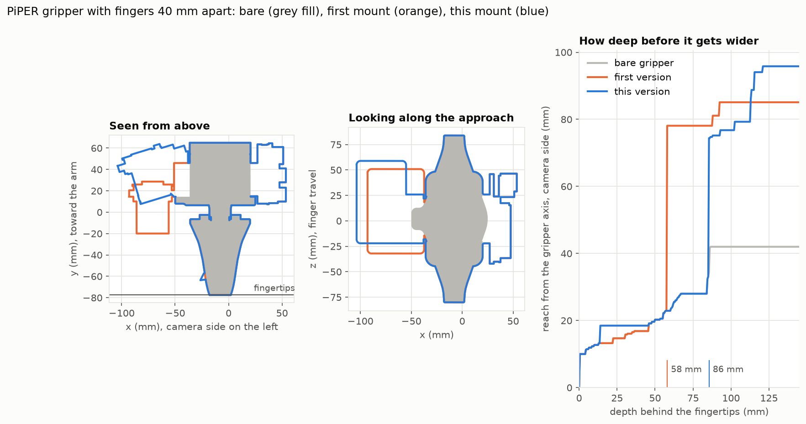

From `envelope.py` (`exports/envelope.json`), fingers 40 mm apart:

- **The mount adds no width for the first 85.5 mm behind the fingertips** (58 mm in the first
  version, whose cameras sat on the tab). The finger tag wedges are the exception: 5.2 mm on the
  camera side from 14 mm behind the tips.
- **Behind that, the wrist is 157 mm across in X** (the bare gripper is 75 mm, the first version
  147 mm): 96 mm out on the camera side and 62 mm on the Pi side. Along the finger travel it is no
  bigger than the fingers themselves (82 mm).
- For working inside a rack or a narrow gap, go in with the camera side facing the open side.

## Hardware

| Qty | Part | Where |
|---|---|---|
| 2 | M3 x 12 socket head (ISO 4762) | Bracket pad into the tab's brass inserts, down the O7 channels with a 2.5 mm hex key. Snug only |
| 4 | M3 x 16 socket head + 4 M3 nuts | Collar clamp. Heads on the carrier side, nuts in the bracket's ears |
| 4 | M3 x 16 socket head + 4 M3 nuts | Pod onto the seat. Nuts dropped into the seat's top and bottom slots |
| 4 | M2.5 x 12 + 4 M2.5 nuts | HQ Camera: heads in counterbores on the pod's front, nuts on the camera's back |
| 4 | M2 x 10 + 4 M2 nuts | Camera Module 3 Wide, the same way |
| 4 | M2.5 x 12 | Pi 5, through the spacers into the nut traps in the carrier |
| 2 | Raspberry Pi Standard-Mini camera cable, 300 mm | Routes are about 206 mm (HQ) and 212 mm (Wide), so the 200 mm cable is too short |
| 1 | Pi 5 Active Cooler | Faces outward (+X) |
| 1 | 24 V supply at the base, a 24 V to 5 V / 5 A USB-C buck converter on the carrier, and a magnetic breakaway | Along the arm; see below and [`power/`](power/README.md) |

**Power** ([`power/README.md`](power/README.md) has the numbers and a shopping list). The Pi 5 gets
its own lead up the arm, with a service loop at each joint. It does not share the gripper's supply:

- **Don't run 5 V up the arm, and don't use a USB-C extension.** The Pi 5 flags under-voltage below
  4.63 V, and a USB-C cable may lawfully drop 0.75 V at its rated current. Over 3 m, even a 5 A
  cable ends up at about 4.55 V under load. With an extension it's 4.4 V or less.
- **Send 24 V (or 12 V) instead, and convert next to the Pi.** Use a small 24 V supply at the base,
  a two-core high-flex lead up the arm, and a 5 V / 5 A buck converter with a USB-C output on the
  carrier, plus a 10 to 15 cm lead to the Pi. The loss in the lead is under 1 %. Most of these
  converters don't speak USB-PD; set `PSU_MAX_CURRENT=5000` in the Pi's EEPROM to tell it the supply
  can do 5 A. Power over Ethernet is the alternative if the streams should be on a wire too.
- **The gripper's power/CAN lead is not for the Pi.** It is a short 4-wire jumper from a socket on
  J6 into a notch in the gripper's back cover, right at the flange ring (y ≈ 48 to 54). The mount
  only has to stay out of its way, and it does: the collar stops at y = 46.
- The PiPER's XT30 at J6 gives 24 V / 2 A that the gripper shares, and
  [ac-dev-lab#328](https://github.com/AccelerationConsortium/ac-dev-lab/issues/328) came to the same
  conclusion for the UR3e: power the Pi separately.
- **Make sure a yank can't reach the Pi's socket**, which is how a lab Pi 5 lost its USB-C port
  ([#234](https://github.com/vertical-cloud-lab/byu-vcl/pull/234#issuecomment-5841723129)). Clamp
  the lead to the carrier 20 to 30 mm from the plug, and put a magnetic breakaway on the arm's side
  of the clamp so a snag pulls it apart (the quick-disconnect idea from ac-dev-lab#328). On a USB-C
  lead, Adafruit's [Magnetic Right Angle USB Type C Adapter](https://www.adafruit.com/product/5521)
  (product 5521, 120 W) also turns the lead 90 degrees to run back along the arm. On the 24 V lead, a
  two-pin magnetic DC connector does the same job and only has to carry about 0.6 A.
- **Check that the Pi 5 sees a 5 A supply.** If the USB-PD offer doesn't get through, the Pi 5
  treats the supply as 3 A and limits its USB ports to 600 mA. That's fine for two CSI cameras,
  which don't use USB, but the Pi will warn about it at boot.

**Assembly order** (the GIF above):

1. Nuts into the bracket: four in the clamp ears and four in the pod seat's slots.
2. Bracket onto the gripper, pad against the tab; the two tab screws.
3. Pi nuts into the carrier, then close the collar with it: the four clamp screws, evenly, until
   the 0.6 mm split just closes at the ears' outer edge (about 130 N per screw, under 0.1 N m), then
   stop. Past that point the faces take most of any extra torque (see
   [The split as a stop](#the-split-as-a-stop)).
4. Cameras onto the pod, the lens into the CS mount, both ribbons plugged in.
5. Pod down its lens axis onto the seat; its four screws.
6. Pi 5 on its spacers, then the ribbons, then the tag wedges on the fingers.

The pod comes off without disturbing the collar or the tab screws. To take the gripper off its
flange, take the mount off first: it covers two of the four countersunk M3 screws in the flange
ring that hold the gripper on.

**Payload:** printed parts 86 g in PLA (Bambu's figure for the whole plate), the Pi 5 with cooler
about 66 g, the HQ Camera and 6 mm lens 83 g, the Wide 4 g, and screws and cables about 27 g. That's
roughly **0.27 kg**. The PiPER carries 1.5 kg and the gripper takes 0.5 kg of that, which leaves
about 0.7 kg for what it picks up.

## Printing

[`slice/`](slice/README.md) slices everything for a Bambu Lab A1 mini in PLA with the Bambu Studio
CLI, the same way as #234 and #238, and writes
[`slice/piper_camera_mount_A1mini_PLA.3mf`](slice/piper_camera_mount_A1mini_PLA.3mf) and
[`slice/report.json`](slice/report.json):

- **One plate:** all five part types, **2 h 48 min and 85.8 g** with 3 walls and 25 % infill on the
  Textured PEI plate. The same parts on the H2D in PAHT-CF weigh 72.0 g (0.4 mm nozzle) or 83.5 g
  (0.6 mm); see [As sliced](#as-sliced-paht-cf-and-pla-simsliced_feapy). Those were sliced before the
  lens cradle was widened, which took 1.6 g of PLA off the bracket.
- **No supports.** Supports are off, and Bambu's own support check flags none of the six objects.
  There are no slicer warnings and no toolpaths off the bed.
- **Overhangs** (`slice/overhangs.json`): the only faces steeper than 45 degrees are the roofs of
  nut slots and counterbores, which print as short bridges. The largest is 34.5 mm² on the bracket.
  The seat's outer face and the carrier's gussets are drawn at exactly 45 degrees.

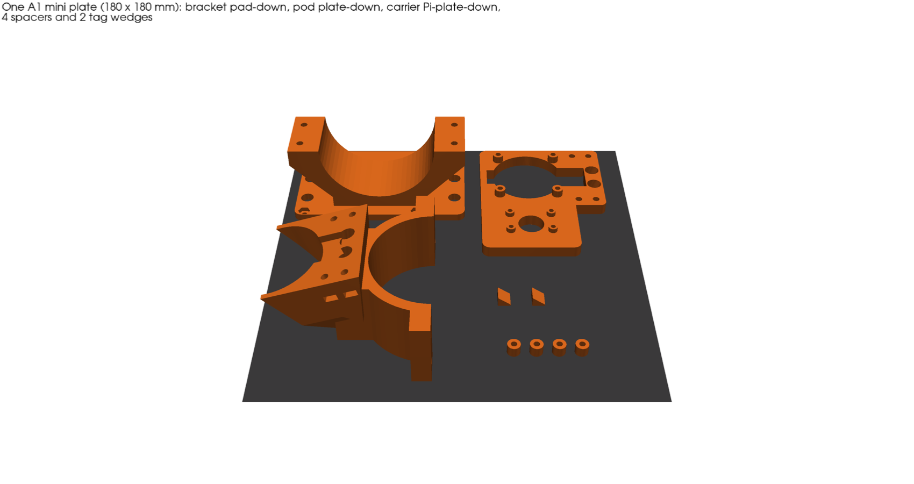

### Material: PAHT-CF on the H2D

PLA is fine for a first fit check. For the mount that stays on the arm, print the bracket and
carrier (and ideally the pod) in **Bambu PAHT-CF** on the H2D. The numbers are from Bambu's
datasheets, dry specimens. "Along" means along the layers, "across" means across them:

| | PLA Basic | PETG HF | PETG-CF | **PAHT-CF** | PET-CF | PPA-CF |
|---|---|---|---|---|---|---|
| Tensile strength along / across (MPa) | 35 / 31 | 34 / 23 | 35 / 29 | **88 / 64** | 74 / 35 | 168 / 57 |
| Tensile modulus along / across (MPa) | 2580 / 2060 | 1810 / 1540 | 2460 / 1340 | 3860 / 2180 | 4730 / 2160 | 11800 / 4300 |
| Heat deflection at 1.8 MPa (°C) | 54 | 62 | 68 | 170 | 182 (annealed) | 196 |
| Water taken up, saturated | 0.43 % | 0.40 % | 0.30 % | 0.88 % | 0.37 % | 1.30 % |
| US price per kg | $20 | n/a | $35 | $95 | $85 | $200 |

Why PAHT-CF:

- **It has the most strength across the layers**, 64 MPa, double PLA's. That's where the clamp loads
  the carrier (see [Stress](#stress-calculix)).
- **It holds screw preload.** It's a PA12-based nylon, and in
  [CNC Kitchen's week-long bolted test](https://www.cnckitchen.com/blog/carbon-fiber-nylon-in-3d-printing-pa6-vs-pa12-tested)
  a PA12-CF joint needed re-tightening once. A PA6-CF joint needed it almost daily.
  [Dimitrellou et al. 2024](https://doi.org/10.1007/s11665-024-09144-9) rank PAHT-CF above PC and
  PLA for creep.
- **It doesn't mind warmth.** It deflects at 170 °C against PLA's 54 °C. PLA sits a few centimetres
  from the Pi 5's heatsink here.
- **The H2D already has what it needs.** Its status report, read over LAN MQTT through the CubXL Pi
  on 2026-09-27, shows:
  - a 0.4 mm hardened-steel hotend on the left. The right is a 0.6 mm TPU High-Flow hotend, so keep
    carbon fibre off that one.
  - an AMS HT, which dries at up to 85 °C. PAHT-CF wants 80 °C for 8 to 12 h, and printing and
    storage below 20 % RH.
  - a heated chamber that reaches 65 °C. PAHT-CF wants 45 to 60 °C.
- **It costs about $7 for this mount.**

The other options:

- **PET-CF** is stiffer along the layers and takes up less water. But it's brittle across them:
  35 MPa, with 2.4 % elongation at break. The carrier's collar is loaded across its layers.
- **PPA-CF** is the stiffest by far. But it's brittle across the layers (0.9 % elongation) and wants
  drying at 100 to 140 °C, which is beyond the AMS HT. It also costs $200/kg.
- **PETG-CF isn't an upgrade.** It's no stiffer than PLA and deflects at 68 °C.
- **Avoid PA6-CF and PA6-GF** in an unconditioned lab. They take up 2.4 to 2.6 % water, and damp
  PA6 loses much of its stiffness.

Notes for printing it:

- **Check the fits first.** Print a coupon with the bore and an M3 nut slot, and measure it,
  because the shrinkage differs from PLA's.
- **Tighten until the split closes, then stop** (see [The split as a stop](#the-split-as-a-stop)).
  The same holds for PLA.
- **Carbon-fibre prints are static-dissipative, not conductive.** The one measured CF nylon was
  about 10⁹ Ω. The Pi sits on its standoffs, clear of the plate, anyway.

Source notes, with every value's datasheet link, are in
[`sim/materials_2026-09-27.md`](sim/materials_2026-09-27.md).

## Stress (CalculiX)

[`sim/ccx_stress.py`](sim/ccx_stress.py) solves the printed parts in [CalculiX](http://www.calculix.de/)
2.21 (`apt install calculix-ccx`). It uses `joint_fea.py`'s gmsh meshes, with a node added at each
edge midpoint, so the elements are CalculiX's C3D10 quadratic tets: 98,817 nodes for bracket + pod.
The results are in [`sim/ccx_stress.json`](sim/ccx_stress.json). The clamp has its own model,
[`sim/ccx_split.py`](sim/ccx_split.py), with both halves together (see
[The split as a stop](#the-split-as-a-stop)).

**These, and the sliced FEA below, predate the wider lens cradle** (October 2026, for the 6 mm lens's
thumbscrews; see [The pod seat](#the-pod-seat)). So does the cross-check against `joint_fea.py`
below, which used that script's mesh at the time. That change took 5.3 cm³ off the seat next to the
lens and nothing anywhere else, so the clamp, collar and cable-yank results stand. The pod-bump and
camera-weight cases load the seat, and they have not been re-run.

**CalculiX gives the same answer as scikit-fem.** Here are `joint_fea.py`'s three cases on the same
mesh (the same node and tet counts) with the same supports:

| 83 g at 1 g along | HQ moves (µm), ccx / scikit-fem | Optical axis tilts (arcmin), ccx / scikit-fem | Largest displacement (µm), ccx / scikit-fem |
|---|---|---|---|
| X | 0.4769 / 0.477 | 0.02944 / 0.0294 | 0.9320 / 0.932 |
| Y | 0.9640 / 0.964 | 0.16157 / 0.1616 | 2.7802 / 2.780 |
| Z | 0.9745 / 0.974 | 0.00957 / 0.0096 | 1.8600 / 1.860 |

They agree to every digit `joint_fea.json` keeps, so the stiffness numbers in
[The pod seat](#the-pod-seat) don't depend on the solver.

**The stress cases.** The model is solid, isotropic PLA, but for a given load the stress hardly
depends on the material. "Across layers" is the normal stress through the layers, using each
part's print orientation from the Printing table. Bump and yank peaks are taken at least 2 mm from
the supports, and clamp peaks at least 1.5 mm from the screw seats.

| Case | Load | Peak von Mises | Peak max principal | Peak tension across layers | Where |
|---|---|---|---|---|---|
| Camera inertia | 83 g at 1 g, each direction | 0.1 MPa | | | |
| Pod bumped | 10 N on the pod's outer edge, worst direction (+Y, toward the arm) | 3.0 MPa | 3.4 MPa | 1.5 MPa | Round the pod seat's top nut slot |
| Cable yank | 10 N at the USB-C plug, worst direction (+X, off the board) | 3.6 MPa | 4.3 MPa | 3.5 MPa | Where the Pi plate meets the collar, at its rear end |
| Clamp, snug | 200 N in each M3 (`ccx_split.py`) | 21.6 MPa | 19.8 MPa | 8.1 MPa | The bracket's ear roots, on the collar's outer face |
| Clamp, about 0.3 N m | 500 N in each M3 (`ccx_split.py`) | 26.0 MPa | 21.4 MPa | 10.5 MPa | Same place |

What it means, against Bambu's datasheet strengths (PLA Basic 35 MPa along the layers and 31 across;
PAHT-CF 88 and 64):

- **The camera's weight and ordinary bumps are no problem.** The pod takes about 100 N (10 kgf) on
  its outer edge before solid PLA reaches its strength, and less with 25 % infill. The seat's nut
  slots are where it would give first.
- **A cable yank is fine once the lead is clamped to the carrier.** Solid PLA takes about 80 N
  sideways before the plate-to-collar joint reaches its strength (about 180 N in PAHT-CF). As
  printed, with walls, infill and layers judged across the layers, it is less: about 60 N in PLA and
  120 N in PAHT-CF (see [As sliced](#as-sliced-paht-cf-and-pla-simsliced_feapy)).
  - The Pi's socket gives up long before that. A straight pull unplugs a USB-C plug at 8 to 20 N (the
    USB-C spec's range), and a sideways pull levers on the socket instead.
  - So the clamp should carry the pull, and the breakaway should let go below what the socket takes.
    See [`power/`](power/README.md).
- **The clamp screws are the biggest load, and the 0.6 mm split now caps it.** 500 N per screw is
  only about 0.3 N m on a dry M3, easy to reach with a hex key.
  - With the 1.0 mm split, the bracket's ear roots reached 59.7 MPa at 500 N, above PLA's 35 MPa.
  - With the 0.6 mm split they reach 21.4 MPa, because the halves meet at about 130 N and the faces
    take most of the rest.
  - In PLA, stop when the split closes, where the peak is about 17 MPa. Expect PLA to relax at that
    stress over weeks. PAHT-CF (88 MPa along the layers) keeps a margin of about 4 even at 1000 N.

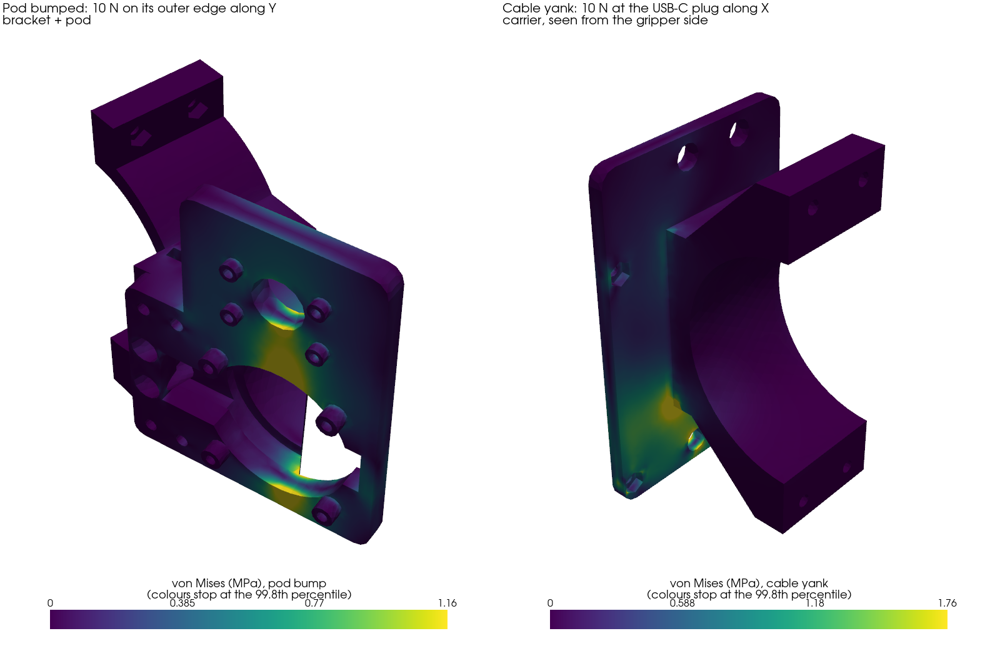

How each case is set up:

- **Pod bump:** bracket + pod bonded, collar bore and tab pad fixed, as in `joint_fea.py`.
- **Cable yank:** the carrier alone with its bore fixed. The plug force is carried to the four
  standoff seats as if through a rigid board.
- **Clamp:** see [The split as a stop](#the-split-as-a-stop).

Limits of the model:

- **The model is solid and isotropic.** A print with 3 walls and 25 % infill is weaker, and
  [As sliced](#as-sliced-paht-cf-and-pla-simsliced_feapy) models the printed parts from their G-code.
- **The peaks sit at sharp inside corners** (the ear roots and nut slots), where the value depends
  on the mesh. A fillet at the ear roots would lower them.

### The split as a stop

The collar's two halves used to be 1.0 mm apart. The split is now 0.6 mm, so the halves meet before
the screws reach snug, and the meeting faces then take most of any extra torque. Here it is cut
through the first pair of clamp screws:

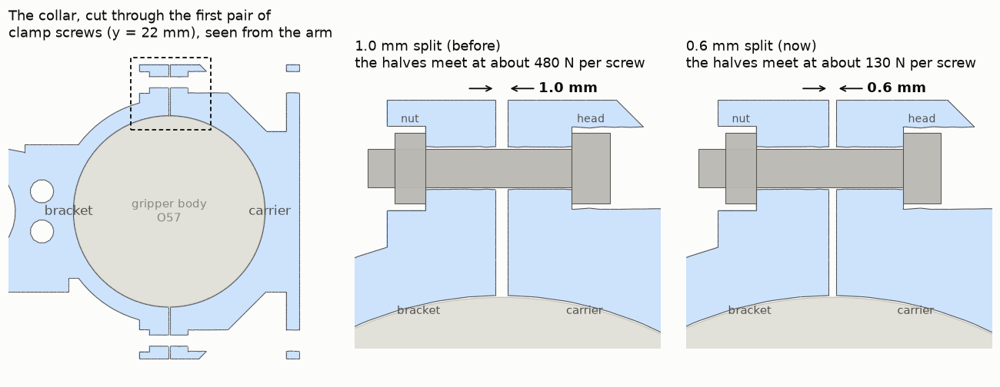

**The model.** [`sim/ccx_split.py`](sim/ccx_split.py) puts both half-collars into one CalculiX model.
`ccx_stress.py` had solved each half alone, which only holds while the split is open: once it closes,
the halves push on each other. The results are in [`sim/ccx_split.json`](sim/ccx_split.json).

- **The body** is rigid, frictionless and 0.15 mm clear all round, as before.
- **The split faces** are frictionless too. Stiff springs join each node of the bracket's face to
  the carrier's face opposite it. A spring is on where the faces meet and off where they would pull
  apart, and the springs and the body contact are iterated together until neither changes.
- **The screws** are forces on the nut-pocket floors and head seats, from 50 to 1000 N in each.
- **One mesh for both.** The 1.0 mm mesh is the 0.6 mm mesh with its split faces moved 0.2 mm apart.
  The peaks sit at the ears' sharp roots, where the value depends on the mesh, and with separate
  meshes they differed by about 20 %.

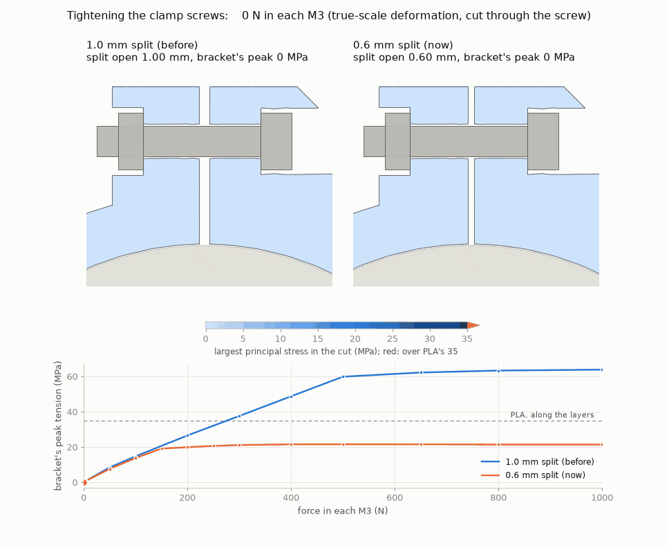

| Force in each M3 | 1.0 mm split | Bracket's peak, 1.0 mm | 0.6 mm split | Bracket's peak, 0.6 mm |
|---|---|---|---|---|
| 100 N | 0.43 mm open | 14.6 MPa | 0.04 mm open | 13.6 MPa |
| 200 N, snug (about 0.1 N m) | 0.31 mm open | 26.4 MPa | closed, faces pushing 112 N | 19.8 MPa |
| 300 N | 0.20 mm open | 37.5 MPa | closed, 326 N | 21.0 MPa |
| 500 N (about 0.3 N m) | closed (at about 480 N), 9 N | 59.7 MPa | closed, 835 N | 21.4 MPa |
| 1000 N (about 0.6 N m) | closed, 1,061 N | 63.8 MPa | closed, 2,370 N | 21.3 MPa |

The gap is the narrowest across the split, at the ears' outer edge. The faces push with the total
force across the split, all four ears together. The peak is the largest principal stress in the
bracket, at least 1.5 mm from the screw seats, and it is always at an ear root on the nut side.

What it shows:

- **The halves meet at the ears' outer edge first, and sooner than I'd estimated.** As each half
  wraps round the body, its ears tip inward. So the faces close first along their outer edge, while
  the inner edge, at the bore, is still about 0.25 mm apart. The 0.6 mm split closes at about
  130 N per screw (about 0.08 N m), not the 200 N I'd estimated from the average closure. The 1.0 mm
  split closes at about 480 N.
- **Until then, both splits behave the same.** The bracket's peak climbs about 11 MPa per 100 N of
  screw force.
- **After that, it stops climbing.** With the 0.6 mm split it is 19.0 MPa at 150 N, 21.4 MPa at
  400 N and 21.3 MPa at 1000 N. The extra force goes into the faces, which press together as in any
  bolted joint: 2,370 N across them at 1000 N per screw.
- **The 1.0 mm split was a stop too, but it came too late.** The ear roots passed PLA's 35 MPa at
  about 280 N per screw (0.17 N m), and they were at about 58 MPa when the faces met.
- **The squeeze on the body keeps rising after the faces meet, but more slowly.** When the split
  closes, the bracket's half presses on the body with about 900 N, summed round the bore. That
  rises to 1,200 N at 200 N per screw and 2,630 N at 1000 N. With the 1.0 mm split it was 1,440 N at
  200 N. The tab screws stop the mount turning anyway.
- **What gives next is the ears themselves, in compression.** At 1000 N per screw, the most stressed
  plastic is in the ears, squeezed between the nuts or heads and the faces: 36 MPa von Mises,
  compressive. That's nearly eight times the force at which the split closes.
- **The absolute peaks depend on the mesh.** They sit at a sharp inside corner. On this mesh the
  1.0 mm split reads 26.4 MPa at 200 N, where `ccx_stress.py`'s per-half meshes gave 17.4 MPa. So
  read the comparison between the splits, which use one mesh, and treat the absolute values as
  rough. A fillet at the ear roots would lower them.

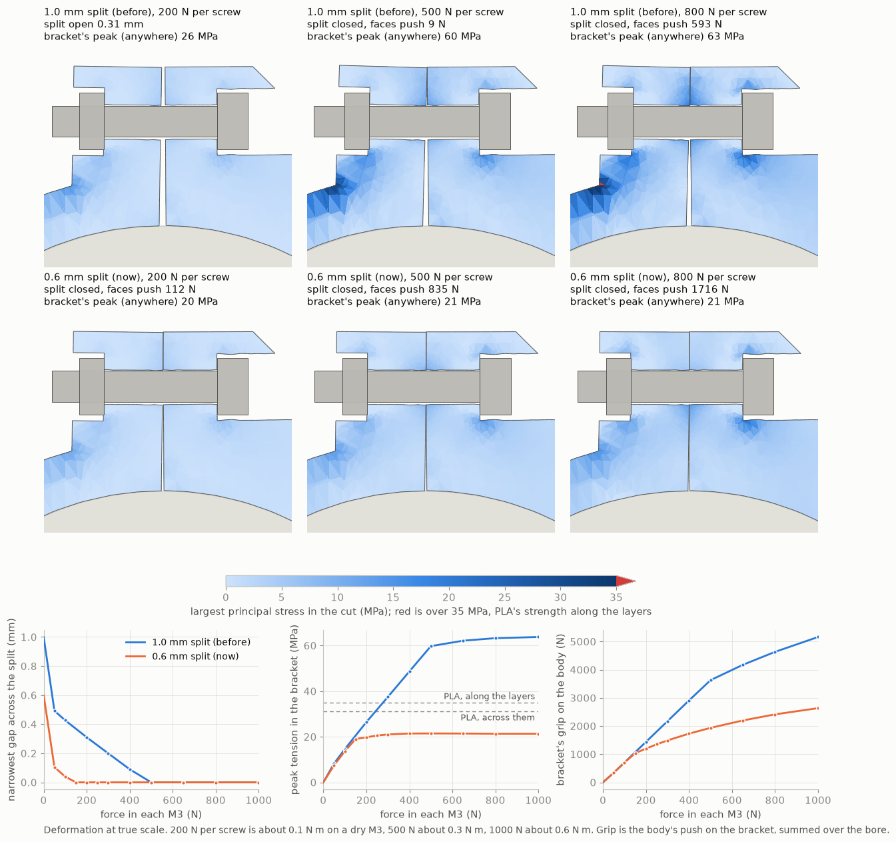

Limits: the plastic is solid, isotropic and linear-elastic, so past PLA's 35 MPa the numbers say
where it would start to give, not what it would do next. The faces are frictionless; friction would
only hold the ears more. The screws are forces, not modelled bolts.

## As sliced: PAHT-CF and PLA (`sim/sliced_fea.py`)

The CalculiX models above treat each part as solid, isotropic PLA. A print is neither. It has three
walls round the outside and 25 % grid infill inside, its beads are stiffer and stronger along their
length than across, and its layers bond more weakly than either.
[`sim/sliced_fea.py`](sim/sliced_fea.py) rebuilds each part from the G-code that would print it, in
PAHT-CF on the H2D and in PLA on the A1 mini, and loads it as the CalculiX models do. The results are
in [`sim/sliced_fea.json`](sim/sliced_fea.json).

**The slices.** [`slice/slice_configs.py`](slice/slice_configs.py) slices each part alone on a plate
with the Bambu Studio 02.08.02.61 CLI, using Bambu's system presets plus this README's 3 walls and
25 % grid infill. It weighs each part from its own G-code
([`slice/slice_configs.json`](slice/slice_configs.json)):

| | Bracket | Pod | Carrier | Whole job | Job time |
|---|---|---|---|---|---|
| H2D, PAHT-CF, 0.6 mm hardened nozzle, 0.30 mm layers | 37.7 g | 13.5 g | 31.7 g | 83.5 g | 3 h 47 min |
| H2D, PAHT-CF, 0.4 mm hardened nozzle, 0.20 mm layers | 31.1 g | 11.9 g | 28.3 g | 72.0 g | 3 h 48 min |
| A1 mini, PLA Basic, 0.4 mm nozzle, 0.20 mm layers | 37.8 g | 14.5 g | 34.4 g | 87.4 g | 2 h 50 min |

- **PLA weighs more** mostly because it is denser: 1.26 g/cm³ in Bambu's preset, against 1.06 for
  PAHT-CF.
- **The 0.6 mm nozzle adds 11.5 g.** Its three walls are 3 × 0.62 mm thick, against 0.42 + 2 × 0.45 mm
  with the 0.4 mm nozzle, so more of each part is solid.
- **Bambu recommends the 0.6 mm nozzle for PAHT-CF,** because a wider nozzle clogs less: the
  [H2D 0.6 mm hardened-steel hotend](https://us.store.bambulab.com/products/bambu-hotend-h2-p2s?id=775924445524066388)
  is $17.99. A 0.5 kg spool ($49.99) is five to six sets at 83.5 g.

**From G-code to a model:**

- **The raster.** [`sim/gcode_voxels.py`](sim/gcode_voxels.py) reads every extrusion on the part's
  plate, with its feature (outer wall, sparse infill and so on), width and layer. It draws each one at
  0.1 mm per pixel in the STL's print frame, and keeps the bead's direction.
- **The voxels.** Each voxel then holds some fraction of bead, in some mix of directions. Its
  stiffness is the bead's orthotropic stiffness, turned to each of those directions and averaged by
  volume (iso-strain). Between infill lines there is nothing. Voxels under 15 % bead are dropped, about
  1 % of the bead volume.
- **The frame.** Each part is placed in the world by the transform its STL was exported with. So the
  supports and loads are those of `ccx_stress.py` and `ccx_split.py`.

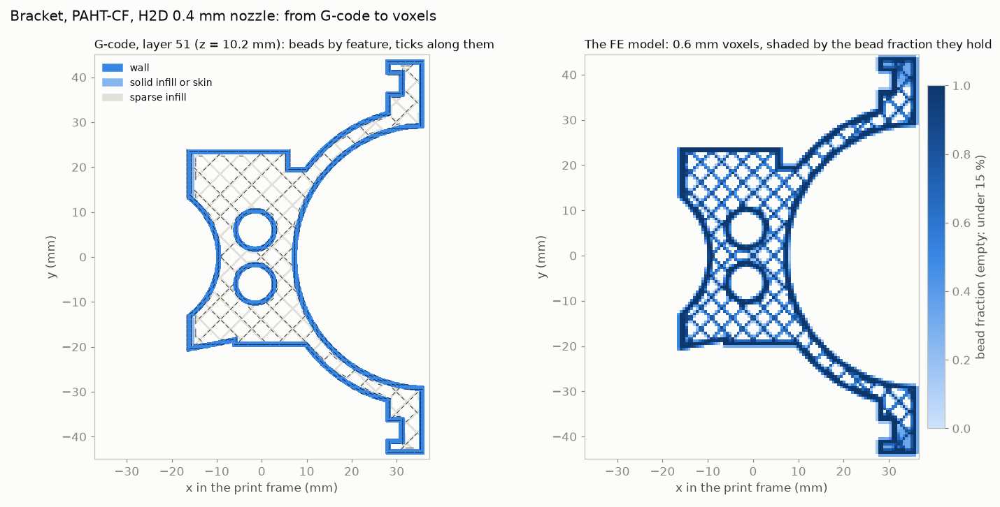

**Bead properties** ([`sim/bead_properties.json`](sim/bead_properties.json), sourced in
[`sim/bead_properties_2026-10-03.md`](sim/bead_properties_2026-10-03.md)). They are back-calculated
from Bambu's datasheets: a model of the datasheet's tensile bar, with its walls and ±45° infill,
reproduces the datasheet's modulus and strength. Dry, room temperature:

| MPa | Stiffness along the bead / across it / across the layers | Tensile strength, same three | Shear strength in a layer / across the layers |
|---|---|---|---|
| PAHT-CF | 7600 / 2700 / 2180 | 120 / 50 / 47 | 47 / 33 |
| PLA Basic | 2800 / 2600 / 2060 | 48 / 33 / 31 | 19 / 18 |

**Failure.** The strain in each voxel gives the stress in each bead direction it holds, in that bead's
own axes. That stress goes into three Hashin-type criteria: along the bead, between beads in a layer,
and between layers. Each is written so that it scales with the load. So a failure index of 1 is the
first failure, and 1 / index is the factor on the load to reach it.

**The clamp** (both halves, with the body and the split as in `ccx_split.py`). It is now solved at
0.6 mm voxels, about 1.6 million unknowns, and at 0.8 and 1.0 mm to check the voxel size. A run
takes 8 to 15 minutes, warm-started from the 1.0 mm solution (see "Solving at 0.6 mm" under
Checks).

| At 0.6 mm voxels | Faces pushing, 200 / 1000 N per M3 | Squeeze on the body, bracket's half, 200 / 1000 N | Collar and ears, bracket / carrier, 200 N | Same at 1000 N | Bracket at the ear root, 200 / 1000 N |
|---|---|---|---|---|---|
| PAHT-CF, 0.6 mm nozzle | 487 / 3,256 N | 420 / 1,059 N | 0.19 / 0.12 | 0.28 / 0.27 | 0.07 / 0.15 |
| PAHT-CF, 0.4 mm nozzle | 498 / 3,334 N | 411 / 967 N | 0.18 / 0.13 | 0.37 / 0.33 | 0.10 / 0.18 |
| PLA | 528 / 3,487 N | 384 / 761 N | 0.25 / 0.26 | 0.66 / 0.68 | 0.16 / 0.46 |
| The same voxels, solid PLA (the check; max principal / 35 MPa) | 439 / 3,056 N | 525 / 1,383 N | 0.25 / 0.13 | 0.38 / 0.26 | 0.10 / 0.20 |
| Solid PLA, CalculiX tets (`ccx_split.py`) | 112 / 2,370 N | 1,198 / 2,634 N | | | 0.57 / 0.61 (19.8 / 21.3 MPa) |

- **"Collar and ears"** means everywhere except the zones under the nuts and heads and the split faces
  (1.5 mm deep). **"Ear root"** is the peak within 2.5 mm of where CalculiX's solid PLA peaks:
  the inside corner where the bracket's ear meets the collar's outer face, at (-16.9, 33.1, 34.3).
- **The voxel size no longer matters much for the clamp as a whole.** In solid PLA, the faces push
  439, 440 and 439 N at snug at 1.0, 0.8 and 0.6 mm, and the squeeze on the body is 565, 526 and
  525 N. The ear root's peak settles too, at 3.1, 3.5 and 3.6 MPa. In the prints, the faces and the
  squeeze move by under 5 % from 0.8 to 0.6 mm, and the ear root settles in PAHT-CF. PLA's ear root
  at 1000 N doesn't: it jumps from 0.26 to 0.46, in a voxel a sixth full of wall (convergence plot
  below).
- **But the voxels still disagree with CalculiX, and refining didn't close the gap.** The voxel
  collar closes its split before 50 N per screw, where CalculiX's needs about 140 N. So at snug the
  voxels put four times CalculiX's force into the faces, squeeze the body half as hard, and bend the
  ears less, which puts a fifth of CalculiX's stress at the ear root (3.6 against 19.8 MPa).
  - **It isn't the voxels' stiffness.** On the pod case, solid-PLA voxels match CalculiX's tets to
    within 9 % on how far the HQ moves at 1 g and 6 % on how far it tilts (see Checks).
  - **So the two clamp models differ somewhere in their set-up.** On paper they match: the same
    clearance, split, crowns, contact rules and screw seats, and the screw loads sum correctly in both.
    I haven't found the difference in this run.
- **The split faces' edges don't converge, so they are judged by hand.** The 1.0 mm table's peaks
  in the collar and ears were mostly on the split faces, beside the screw holes and at the ends of the
  ears. There they grow or jump about as the voxels shrink. PAHT-CF with the 0.6 mm nozzle, bracket,
  at 1000 N: 0.64, 0.65, then 1.43. A flat, frictionless contact with a sharp edge has an infinite pressure at
  that edge, so a finer model only finds a higher peak. On average the faces press at 6 to 7 MPa at
  1000 N per screw (3,260 to 3,490 N over 480 to 560 mm² in contact). That is about a tenth of PLA's
  or PAHT-CF's strength in compression. Real edges are rounded, and a few tenths of a millimetre of
  crushing there spreads the load.
- **The collar and ears** peak on the collar's outer face about 40 degrees from the crown, where the
  ring bends round the body, and in partly filled voxels at the walls' edges. Those still drift with
  the voxel size. For PLA at snug the peak is 0.17, 0.20, then 0.25.
- **Is printed PLA near its limit at snug? It depends on which clamp model is right.**
  - By the voxels: no. Printed PLA reaches 0.25 in the collar and ears at snug, and 0.16 at the
    ear root. At 1000 N it reaches 0.68 and 0.46.
  - By CalculiX: close. On the same voxels, printing raises the ear root's index 1.55 times over solid
    PLA (0.159 against 3.6 / 35 = 0.103). Applied to CalculiX's 0.57, that gives about 0.9 at snug.
  - PAHT-CF keeps a margin either way. With the 0.6 mm nozzle it reaches 0.07 at the ear root by
    the voxels, and about 0.4 by CalculiX scaled the same way (0.71 times solid PLA). With the 0.4 mm
    nozzle it reaches 0.10, and about 0.55 (0.95 times).
  - So **print the clamp in PAHT-CF**. In PLA, stop at snug, when the split just closes.
- **Under the heads and nuts, by hand.** The voxels can't resolve these: at 0.6 mm a nut bears on 26 to
  28 nodes of the printed bracket and a head on 14 to 20 of the carrier, so the section below sets
  them apart.
  - A head bears on 14.7 mm² of the carrier's counterbore floor (0.068 MPa per N) and presses it across
    the layers. PLA's 65 MPa there is reached at about 950 N per screw, and PAHT-CF's 75 MPa at about
    1,100 N.
  - A nut bears on 17.1 mm² of the bracket (0.058 MPa per N), within its layers: about 1,200 N in PLA
    and 1,370 N in PAHT-CF.
  - So **tighten to snug, not past it**, in either material.

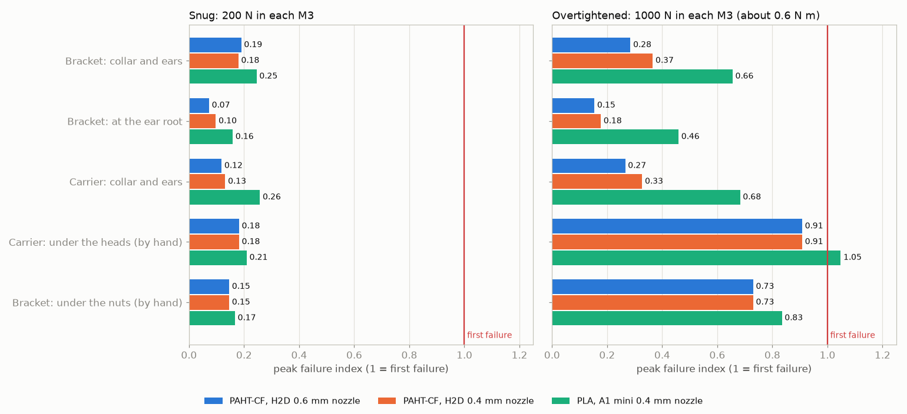

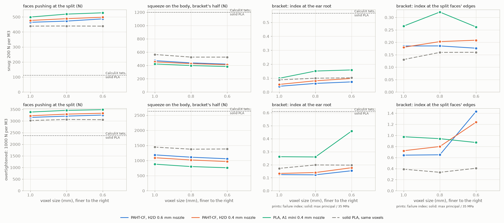

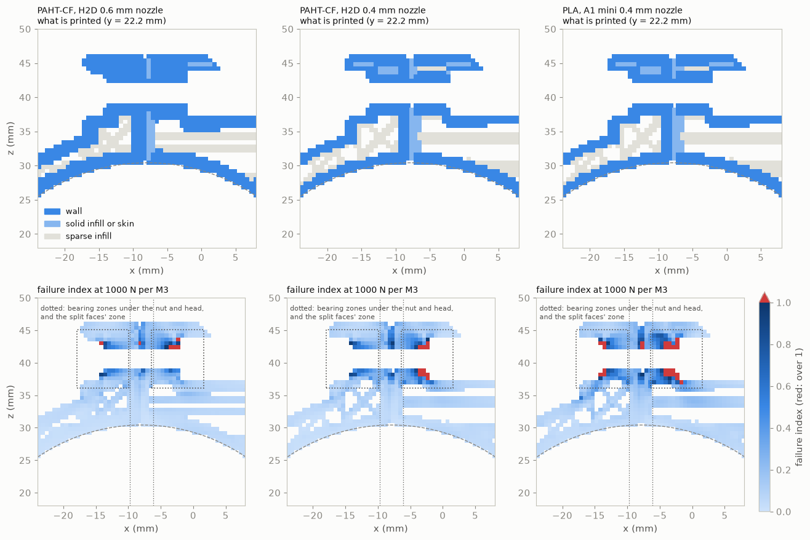

**The cable yank** (the carrier alone at 0.6 mm voxels, 10 N at the USB-C plug):

| | Worst direction | First failure, voxel model | Allowing for the voxels' corners (see Checks) | Where, and how |
|---|---|---|---|---|
| PAHT-CF, 0.6 mm nozzle | +X, off the board | 81 N | about 120 N | between beads in a layer, in the solid skin where the plate meets the collar |
| PAHT-CF, 0.4 mm nozzle | +X | 85 N | about 125 N | between layers, in the outer wall at the same joint |
| PLA | +X | 43 N | about 60 N | between layers, at the same joint |

- **The joint is the one CalculiX found:** the rear end of the plate, where it meets the collar. As
  printed, it gives between the layers.
- **That is below the solid estimate,** which was about 80 N for PLA and 180 N for PAHT-CF. Two
  things lower it. The printed walls and infill raise the peak tension across the layers by 13 % in
  PLA, on the same voxels (5.73 against 5.06 MPa). And the joint is now judged by its strength across
  the layers, with the shear there counted, rather than by PLA's strength along them.
- **It is still well above what the socket takes.** A straight pull unplugs a USB-C plug at 8 to
  20 N, and a sideways pull levers on the socket long before 60 N. So the strain-relief clamp and the
  magnetic breakaway in [`power/`](power/README.md) still decide what breaks first.

**The pod** (bracket and pod at 1.0 mm voxels, the pod tied to the seat as in `joint_fea.py`, the
bore and tab pad fixed):

| | HQ moves at 1 g along X / Y / Z | Optical axis tilts, X / Y / Z | Pod bump, 10 N on its outer edge: first failure |
|---|---|---|---|
| PAHT-CF, 0.6 mm nozzle | 0.41 / 0.91 / 0.83 µm | 0.025 / 0.139 / 0.011 arcmin | 204 N, along +Y (toward the arm) |
| PAHT-CF, 0.4 mm nozzle | 0.50 / 1.08 / – µm | 0.031 / 0.165 / – arcmin | not solved: the Z case stalled, and the run stopped before writing |
| PLA | 0.64 / 1.50 / 1.43 µm | 0.046 / 0.243 / 0.023 arcmin | 75 N, along +Y |
| Solid PLA, CalculiX tets | 0.48 / 0.96 / 0.97 µm | 0.029 / 0.162 / 0.010 arcmin | about 100 N |

- **The camera's weight still doesn't matter.** The printed PLA pod lets the HQ tilt at most 0.24
  arcmin at 1 g, which is 0.27 px at the 6 mm lens. PAHT-CF, with its stiffer beads, tilts it 0.14 to
  0.17 arcmin.
- **A knock is where the material shows.** PLA gives at 75 N on the pod's outer edge, and PAHT-CF with
  the 0.6 mm nozzle at about 200 N. Both give at the top end of the seat, where the bonded joint ends.
  That end is a sharp edge in a bonded model, so read the exact values as rough, and the ratio between
  the materials as the result.

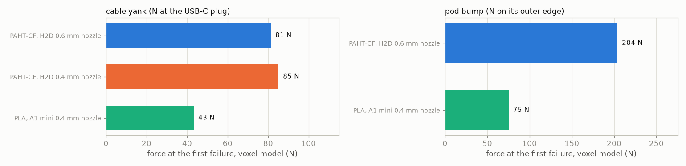

**Checks:**

- **The raster against the G-code.** The beads land on the STL: their extent matches its outline to
  0.01 mm, and the carrier's top layer is at 38.60 mm against the STL's 38.61. The raster holds 4 %
  more bead than the filament the G-code pushes (the carrier, 0.4 mm nozzle). That is expected:
  Bambu meters a bead with rounded sides, and the raster fills its whole width by the layer height.
  The bead properties are per gross area too, as the datasheet bars are, so the raster's area is the
  right one to use. Bridges are the exception, at 34 % under: Bambu prints them as round beads one
  nozzle wide, and the raster gives them one layer.
- **The voxels against CalculiX.** The yank on the same 0.6 mm voxels, filled with solid PLA as in
  `ccx_stress.py`, puts its peak at the same place: the plate-to-collar joint, (26.5, 45.7, -21.8)
  against CalculiX's (26.0, 46.0, -21.1). The peak is 1.45 times CalculiX's across the layers (5.06
  against 3.50 MPa) and 1.49 times in max principal (6.45 against 4.33 MPa). That is the voxels'
  staircase at a sharp inside corner. In the other directions, where the peaks are small and spread
  out, the two differ by up to 30 % either way. So at a sharp corner the voxel peak overstates the
  stress by roughly that factor, which the yank table allows for.
- **The voxels' stiffness against CalculiX's.** The pod case on 1.0 mm voxels filled with solid PLA
  ([`sim/sliced_fea.json`](sim/sliced_fea.json), `h2d_pahtcf_04 / solid / 1.00 mm / pod`): at 1 g
  along X / Y / Z the HQ moves 0.434 / 0.959 / 0.908 µm, against CalculiX's 0.477 / 0.964 / 0.974,
  and tilts 0.0296 / 0.1630 / 0.0101 arcmin, against 0.0294 / 0.1616 / 0.0096. So the elements and
  the material model agree with CalculiX's. The clamp's disagreement comes from somewhere else.
- **The clamp against CalculiX:** see the clamp table. The solid-PLA voxel collar closes its split
  before 50 N per screw. At 1.0 mm, from 50 to 150 N, the faces already push 63, 184 and 306 N,
  while CalculiX's split is still 0.04 mm open at 100 N and closes at about 140 N. The faces' force
  at snug is the same at every voxel size, so this is not resolution. Two more checks on the voxel
  side (`--check`, 1.0 mm, solid PLA):
  - **`crowns`.** Started as `ccx_split.py` starts, with the body within 30 degrees of each crown and
    the split open, the voxels settle to the same answer: within 1 % on the faces and 3 % on the
    squeeze.
  - **`bonded`.** With no bore node allowed to leave the body, the split closes even sooner: the faces
    push 105 N at 50 N per screw. So a bore held on too much wouldn't stiffen a collar the way
    CalculiX's is stiffer.
- **Voxel size.** The clamp at 1.0, 0.8 and 0.6 mm, in all four models, is in the convergence plot
  above. The 0.8 mm yank and the PAHT-CF 0.4 mm pod's Z case, which stalled before, weren't re-run.
  The PAHT-CF 0.4 mm pod's row therefore still has the camera's X and Y only, from the earlier
  run's log, and no bump.
- **Solving at 0.6 mm.** The clamp at 0.6 mm has 1.6 to 1.7 million unknowns. The solver is pyamg's
  smoothed aggregation as CG's preconditioner, with each half's six rigid-body modes as its
  near-null space.
  - **AMG reuse.** The hierarchy is rebuilt when over 1 % of the contact rows change. Otherwise it is
    reused until CG needs 25 iterations on it.
  - **Warm start.** Each contact row starts in the state of the nearest row of the 1.0 mm solution,
    and each node starts at the 1.0 mm displacements. The contact loop then settles in 4 to 7
    iterations, against 12 to 16 from cold.
  - **Run times.** 8 to 15 minutes and about 8 GB per model, on 4 cores.
  - **Two things that didn't work.** A sparse Cholesky (MKL PARDISO, `--solver direct`) is three
    times faster at 1.0 mm and gives the same answers (PLA's index 0.3449 against 0.3453 by AMG), but
    at 0.6 mm its factor wants 14.5 GB. Six rigid-body modes shared by both halves would halve the
    coarse grids, but CG then needs 1.5 to 3 times the iterations: the split holds the halves only
    along its normal, so they slide past each other, which a rigid motion of both together can't
    represent.
- **Contact.** Every clamp solve settled. At the last iteration, at most 18 of the 9,000 to 24,000
  contact rows (body and split) were still changing.

**Limits:**

- **Resolution.** The clamp uses 0.6 mm voxels (with 0.8 and 1.0 mm as checks), the yank 0.6 mm and
  the pod 1.0 mm. The walls are 1.3 to 1.9 mm thick, so they are two or three voxels at 0.6 mm. The
  clamp as a whole has converged: the faces, the squeeze and the ear root's peak barely move from
  0.8 to 0.6 mm. Its peak indices still sit in partly filled voxels at the edges of walls, and they
  drift by 10 to 25 % between voxel sizes, so read them to about that. The split faces' edges don't
  converge at all, and are judged by hand.
- **The clamp model disagrees with CalculiX's** on how easily the collar closes (see above), by
  about a factor of four on the faces' force at snug. Until that is settled, PLA's margin at the
  ear roots is somewhere between 0.16 and 0.9 at snug.
- **Within a voxel, the beads share one strain** (iso-strain), which is an upper bound on its
  stiffness.
- **The bead properties are inferred from datasheets.** PAHT-CF's stiffness along the bead is the
  least certain (4,600 to 9,500 MPa). A 0° and a ±45° coupon printed on the H2D with this profile would
  pin it down.
- **They are dry and short-term.** Damp PAHT-CF (saturated at 55 % RH) loses 8 to 20 % of its
  strength by Bambu's figures. Nothing here covers creep, which matters more for PLA under the
  clamp's load, or heat.
- **Linear elastic to the first failure.** Past an index of 1, the numbers say where a part starts to
  give, not what it does next.
- **The pod is bonded to the seat,** as in `joint_fea.py`. The four M3s and the real contact at the seat
  are not modelled.
- **Nothing has been printed yet.**

## Checks (`exports/checks.json`)

`piper_mount.py` builds everything, runs the checks and exits non-zero if anything interferes. All
pass:

- **Overlap:** 0 mm³ for all 61 pairs. Each part is checked against the gripper body, against the
  fingers both closed (0 mm) and fully open (100 mm), and against each other.
- **The lens's thumbscrews at any angle:** each screw's whole circle is checked against the bracket,
  the pod, the Wide and the gripper, and comes out at 0 mm³. They stay 1.5 mm from the bracket and
  14.2 mm from the finger plate.
- **Clearance to the fingers:** the nearest part stays 15.6 mm away with the fingers closed and
  17.8 mm away fully open. The finger tag wedges stay 72 mm from the mount.
- **Views:** no printed part is inside the HQ's view. The Wide's view takes in 2,890 mm³ of the
  bracket (its top ear; 11 mm³ more than with the 1.0 mm split) and 134 mm³ of the carrier's edge.
- **Split:** the collar halves are 0.6 mm apart (it was 1.0 mm). The clamp closes that at about
  130 N per screw, after squeezing the body (see [The split as a stop](#the-split-as-a-stop)). The
  bore is 0.15 mm over the body per side.
- **Rear limit:** the rearmost point is 64.5 mm, against the flange face at 64.98.

**AgileX's flange solid is a special case.** OCC treats it as touching everything: the distance to
the Pi 5, 15 mm away, comes out as 0. So the checks stand a plain O57 x 10.5 mm cylinder in its place
(`reference.flange_proxy`). The cylinder is solid where the flange is hollow, which only makes the
checks stricter.

## Onshape

The design is in Onshape in the lab's **vcl-shared › 6DOF Robot Arm** folder:
[PiPER wrist camera mount (4be6e17)](https://cad.onshape.com/documents/93ef145982c24192bfd160be/w/e3d08fcb2dcad7c92e183721).
It's owned by Vertical Cloud Lab and it's private. It still has the 1.0 mm clamp split; the 0.6 mm
split came later, so re-import `exports/assembly.step` to bring it up to date. Open the **Mount on
gripper** tab:

| Tab | What's in it |
|---|---|
| Mount on gripper | The assembly. Both Part Studios below are inserted whole, at the origin, so the mount sits on the gripper exactly as in the renders |
| Mount parts (exports/assembly.step) | Our parts, plus envelopes of the Pi 5 and the cameras |
| AgileX gripper (reference, do not share) | AgileX's gripper STEP, 13 parts. Onshape shows AgileX's Chinese part names garbled; they read 电机加底座 (motor and base), 法兰 (flange), 夹爪 (jaw) and 推力轴承 (thrust bearing), and MGN7 is the linear rail and its carriages |
| Part Studio 1 | Empty. Onshape's default tab, which the API key can't delete (HTTP 403), so delete it in the web app |

AgileX's gripper went in on 2026-09-27 with
[`onshape/add_gripper.py`](onshape/add_gripper.py) (about 15 API calls,
[record](onshape/run_2026-09-27_gripper.json)). The mount was built in the frame of that STEP, so
the two line up with no mates. AgileX publishes the STEP without a licence, so the repo downloads it
at run time instead of committing it. For the same reason, **keep this document private** (the script
refuses to import into a public one).

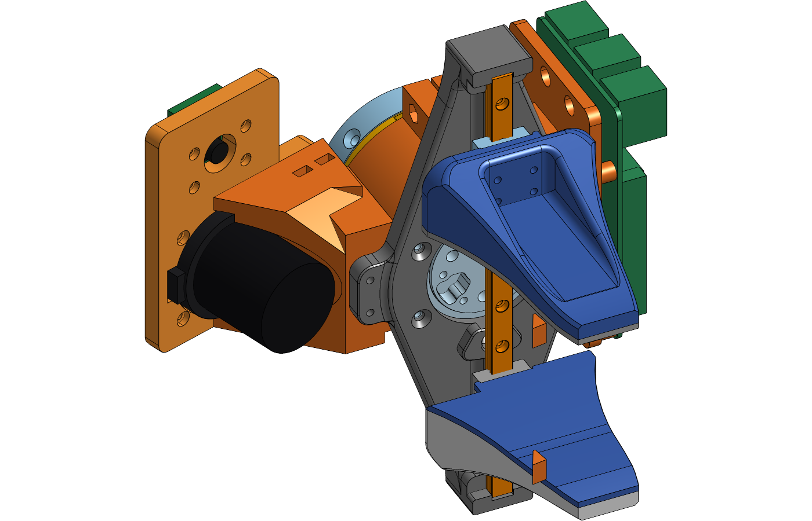

[`onshape/onshape_import.py`](onshape/onshape_import.py) made the document over the REST API in
**7 calls**, plus 3 to check the copy and fetch the shaded view below (the plan allows 2,500 a
year):

1. Create a document.
2. Import `exports/assembly.step`.
3. Copy the workspace into the folder with the documented `copyWorkspace` call.

API keys can't move a document between folders; the web app's endpoint for that returns 403, as
found in #234. So the uncopied original is also left in the API key owner's account, and can be
deleted from there. The run record is in
[`onshape/run_2026-09-27.json`](onshape/run_2026-09-27.json). The earlier import of the first
version, [PiPER wrist camera mount (9f691e6)](https://cad.onshape.com/documents/e22711217c260359b417d4ab/w/a89539f5f5ee3273f944af9c)
([record](onshape/run_2026-09-26.json)), is in the same folder and can be deleted.


The parts are imported solids, not native sketch-and-extrude features. For editable geometry,
rebuild from `Params`, the way #234's `onshape_api.py` does for the lid mount's base.

## Running it

```bash
pip install -r cad/requirements.txt       # plus opencv-contrib-python, shapely, matplotlib, pillow for the extras
cd cad
python piper_mount.py                                                # checks + exports/*.step, *.stl
xvfb-run -a -s "-screen 0 1920x1080x24" python render.py            # renders/*.png
xvfb-run -a -s "-screen 0 1920x1080x24" python fiducials.py         # renders/view_*.png, exports/fiducials/
xvfb-run -a -s "-screen 0 1920x1080x24" python lens_compare.py      # 6 mm vs 16 mm: renders/lens_compare.png (~5 min)
python envelope.py                                                   # renders/tight_spaces.png
xvfb-run -a -s "-screen 0 1920x1080x24" python animate.py           # renders/assembly_steps.gif (gifsicle shrinks it)
python ../slice/slice_a1mini.py --bambu ~/bambu/squashfs-root       # see slice/README.md
python ../slice/slice_configs.py --bambu ~/bambu/squashfs-root      # each part alone, 3 printer/material setups
python ../sim/joint_fea.py                                           # pod joint stiffness, scikit-fem
xvfb-run -a -s "-screen 0 1920x1080x24" python ../sim/ccx_stress.py  # stresses in CalculiX (apt install calculix-ccx)
xvfb-run -a -s "-screen 0 1920x1080x24" python ../sim/ccx_split.py   # the clamp's split, both halves (about 40 min)
python ../sim/sliced_fea.py --cases yank                             # the parts as sliced (needs slice_configs.py's G-code)
python ../sim/sliced_fea.py --cases clamp pod zones --h 1.0          # (about 15 min per setup)
python ../sim/sliced_plots.py                                        # renders/sliced_*.png
python ../power/voltage_drop.py                                      # power/README.md's table
python ../onshape/add_gripper.py --doc 93ef145982c24192bfd160be --ws e3d08fcb2dcad7c92e183721   # done once
```

- **AgileX's STEP isn't committed.** AgileX publishes it with no licence, so
  [`cad/reference.py`](cad/reference.py) downloads it from AgileX's CDN into `cad/.cache/` (about
  2.9 MB), the same way the lid mount handles Opentrons' OT-2 STEP. It also records the SHA-256 it was
  checked against.
- **The exports contain only our parts** (and simple envelopes of the Pi and cameras), not AgileX's
  geometry.

## Assumptions and what to check first

- **Which gripper the lab has.** AgileX has made two. On the 0 to 100 mm gripper the tab's inserts
  sit 38 mm off the axis, as in the STEP used here. On the older 0 to 70 mm gripper they sit at
  36 mm, and the pad would need moving 2 mm. Tell them apart by the maximum opening, or by the
  finger plate's width: about 164 mm against 145 mm.
- **The tab screws go into brass inserts in the gripper's plastic.** Snug them; don't torque them.
- **Estimated dimensions:**
  - The 6 mm lens's O30 x 34 mm and 53 g are the maker's figures. Its thread length (4 mm), ring
    layout and thumbscrews are estimates, measured off product photos
    ([`cad/lenses.py`](cad/lenses.py)). Most of all, check how far the thumbscrews stand out: the
    cradle allows for 5 mm plus 1.5 mm of clearance.
  - The Pi 5's connector positions are read off Raspberry Pi's drawing, and its outline is a
    simplified envelope, as in #234.
- **Nothing has been printed yet.**
  - The clearances reuse the numbers from #234's A1 mini fit study (M3 nut slot 5.8 mm across
    flats, 0.15 mm per side on the body).
  - The collar grips by squeezing the body until the split closes. The solid model put that squeeze
    at about 900 N for each half, summed round the bore, when the split closes. Printed with walls and
    25 % infill, the collar is softer, and like for like the squeeze is about a fifth less at snug (see
    [As sliced](#as-sliced-paht-cf-and-pla-simsliced_feapy)). Either way it is set by the geometry,
    not the torque: the clearance takes 0.3 mm of the 0.6 mm split and the squeeze gets the rest. So a
    bore printed 0.05 mm oversize per side leaves a third less squeeze, and one 0.15 mm oversize
    leaves none. Check the bore on a coupon first. If it slips, a strip of 0.5 mm rubber inside it will
    help.
  - For the parts that stay on the arm, print in PAHT-CF rather than PLA (see
    [Material](#material-paht-cf-on-the-h2d)), because PLA creeps under clamp load. The xArm mount
    in [ac-dev-lab#527](https://github.com/AccelerationConsortium/ac-dev-lab/issues/527) was PETG.
- **Relation to #238** (Pi 5 dual-camera mount): that design wasn't ready when this was made.
  - The pod uses the same hole patterns: HQ M2.5 on a 30 mm square, Camera Module 3 M2 on
    21 x 12.5 mm.
  - If #238 settles on a camera module, a new pod can take its place on the same seat and four
    screws, without touching the collar or the tab interface.
- **HQ Camera alone:** it can stream as well as take snapshots, using the picamera2 main + lores +
  `CircularOutput` approach tested in
  [borysgroup/streamingLambda#10](https://github.com/borysgroup/streamingLambda/pull/10). In that
  case, leave the Wide off; its station is just four holes.
- **Side mounting:** the mount doesn't care which way up the arm is. If the arm is side-mounted as
  discussed in [#229](https://github.com/vertical-cloud-lab/byu-vcl/issues/229#issuecomment-5826036827),
  include the mount's ~0.27 kg in `set_payload()`.
