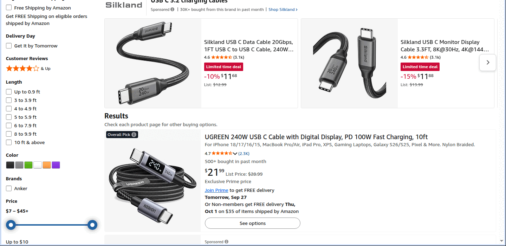

# Powering the Pi 5 on the PiPER's wrist

The Pi 5 rides on the gripper. Its power has to come about 3 to 3.5 m from a power strip at the arm's
base, up the arm, with a service loop at each joint. The lab has one supply for it so far, Raspberry
Pi's [27 W USB-C supply](https://www.raspberrypi.com/products/27w-power-supply/): 5.1 V / 5 A on a
captive 1.2 m, 17 AWG lead, from a bulky wall plug. That lead doesn't reach, and the plug can't ride
on the arm.

A lab Pi 5 has already lost its USB-C socket to a yanked cable
([#234](https://github.com/vertical-cloud-lab/byu-vcl/pull/234#issuecomment-5841723129), the CubXL
Pi). So besides getting power up the arm, the socket must never be what takes the pull.

## Why not a USB-C extension

- **At 5 V, every milliohm counts.** The Pi 5 flags under-voltage below **4.63 V**, measured after
  its input fuse. A 5.1 V supply leaves 0.47 V for everything between the supply and the board.
- **A compliant USB-C cable may drop 0.75 V on its own:** 500 mV on VBUS plus 250 mV on GND at its
  rated current ([Benson Leung](https://medium.com/@leung.benson/what-does-it-mean-when-a-usb-c-cable-is-rated-at-3a-52b4fd66385e),
  from the USB Type-C spec). Longer cables are only compliant because they use thicker wire.
- **Extensions aren't allowed by the USB-C spec.** They add length and a second mated connector
  that no cable's budget allows for. They can also pass the supply's 5 A advertisement on through a
  lead that can't carry it.
- **The Pi 5 draws about 1.5 A** streaming two cameras, and up to 2.5 A with a busy CPU and the
  fan at full speed.

[`voltage_drop.py`](voltage_drop.py) ([`voltage_drop.json`](voltage_drop.json)). Copper at 20 °C, VBUS and GND both carrying the current, 20 mΩ per mated USB-C pair:

| Route (3 to 3.5 m to the wrist) | at 1.5 A | at 2.5 A |
|---|---|---|
| Official 27 W supply alone: its 1.2 m, 17 AWG lead (too short to reach) | 5.01 V | 4.95 V |
| Official supply + 2 m USB-C extension (22 AWG, one more mated pair) | 4.66 V | 4.37 V (low) |
| Official supply + 2 m 240 W (5 A) extension, if it really is 20 AWG | 4.78 V | 4.57 V (low) |
| Official supply + 2 m extension of a thin 3 A cable (26 AWG) | 4.18 V (low) | 3.56 V (low) |
| 5 A PD supply + one 3 m 5 A cable (20 AWG) | 4.77 V | 4.55 V (low) |
| 5 A PD supply + one 3 m 3 A cable (24 AWG) | 4.31 V (low) | 3.79 V (low) |
| iUniker 5.25 V / 4 A, 1.5 m lead (if 18 AWG) + 2 m 240 W extension (20 AWG) | 4.90 V | 4.66 V |
| Any PD charger's 5 V / 3 A profile (5.0 V) + a 3 m 240 W cable (20 AWG) | 4.64 V | 4.39 V (low) |
| 5 V / 2 A camera adapter with its 3 m USB-A to C cable (if 24 AWG) | 4.17 V (low) | 3.62 V (low) |
| 24 V up 3.5 m of 22 AWG, 5.1 V buck converter at the Pi | 5.10 V | 5.10 V (the converter sees 23.78 V; 0.9 % lost) |
| 12 V up 3.5 m of 22 AWG, 5.1 V buck converter at the Pi | 5.10 V | 5.10 V (the converter sees 11.56 V; 3.6 % lost) |
| Any PD charger with a 12 V profile + one 3 m 240 W cable, PD step-down board at the Pi | 5.10 V | 5.10 V (the board sees 11.71 V; 2.4 % lost) |
| Official supply's 12 V profile + 2 m 240 W extension, PD step-down board at the Pi | 5.10 V | 5.10 V (the board sees 11.72 V; 2.3 % lost) |

Even the best 5 V route, one continuous 3 m cable with 20 AWG conductors, sags under load. Any
extension is marginal at best.

## If you'd rather try an extension first (8 October 2026)

At the 1.5 A the Pi draws streaming two cameras, an extension rated for 240 W (5 A) leaves the Pi
at about 4.78 V, if its conductors are really 20 AWG. That's above 4.63 V, but only by 0.15 V. A
busy CPU (2.5 A) takes it under. No listing gives the gauge, so it's a $9 experiment, not a
design:

- **What to buy:** [AINOPE 240 W USB-C extension, 6.6 ft, B09FDWG61C](https://www.amazon.com/dp/B09FDWG61C),
  $8.99, in stock, checked through the CubXL Pi on 8 October. With the official supply's 1.2 m
  lead it reaches about 3.2 m.
- **How to tell whether it works:** on the wrist, stream both cameras and load the CPU, then read
  `vcgencmd pmic_read_adc EXT5V_V` (the Pi's own input voltage) and `vcgencmd get_throttled`.
  Any bit 0 or 16 set means under-voltage. If either shows up, go to the 24 V route below.
- **It still needs the strain relief.** An extension adds a second plug that can lever on a
  socket, so clamp the lead to the carrier as below.

## Supplies not made by Raspberry Pi (8 October 2026)

A second search through the CubXL Pi looked for any supply that both powers the Pi 5 and reaches
the wrist. The details are in [`shopping_2026-10-08.md`](shopping_2026-10-08.md).

- **At 5 V, none does.**
  - Where a supply with 3 A or more at 5 V gives its lead's length, it's 1 to 1.5 m.
  - The 3 m and 5 m 5 V adapters are 2 A (10 W) camera chargers, and they'd leave the Pi at 4.2 V.
  - Chargers sold with 10 ft cables give only 3 A at 5 V, and through 3 m that's 4.64 V.
- **The best 5 V-only test:** [iUniker's 5.25 V / 4 A supply](https://www.amazon.com/dp/B097P2NLVH)
  ($9.99) through the same 2 m extension. Its extra 0.15 V puts the Pi at 4.90 V streaming and
  4.66 V with a busy CPU, if its lead is 18 AWG. It has no PD, which CSI cameras don't need.
- **What does reach with margin is 12 V on the USB-C cable,** turned into 5 V on the carrier by a
  PD step-down board such as [eleUniverse's](https://www.amazon.com/dp/B0FR8VRWFJ) ($20.99, 34 g,
  9 to 24 V in, 5 V / 5 A out).
  - **Which cables work:** the board asks the charger for 12 V, so either the official supply
    through the extension, or any 12 V-capable charger and a 10 ft 240 W cable. At about 1.2 A on
    the cable, the drop no longer matters.
  - **Check the charger:** many phone and laptop chargers skip 12 V and offer only 5, 9, 15 and
    20 V.
  - **On the carrier:** fixed there, it puts its own socket, not the Pi's, at the end of the long
    cable. The carrier's CAD has no place for it yet.

## What people do instead: send a higher voltage and convert at the Pi

Robot integrators rarely send 5 V up an arm. They send 24 V (the arm's own tool voltage) or 48 V
Power over Ethernet, and put the 5 V converter next to the load. At 24 V the current is a fifth as
much for the same power, so the loss is a twenty-fifth. Thin, flexible wire is enough, and the
converter holds the Pi at 5.1 V whatever the lead does.

1. **24 V (or 12 V) plus a buck converter on the carrier (recommended).** Use a small 24 V supply at
   the base, and a two-core high-flex lead up the arm with the service loops. A 5 V / 5 A buck
   converter with a USB-C output sits on the carrier, with a 10 to 15 cm USB-C lead to the Pi. It's
   light and cheap, and a breakaway on a two-wire DC lead is easy. Don't take the 24 V from the
   PiPER's J6 XT30: the gripper shares that 2 A.
   - Almost none of these converters speak USB-PD. Without it, the Pi 5 assumes 3 A and caps its
     USB ports at 600 mA, which CSI cameras don't notice.
   - Setting `PSU_MAX_CURRENT=5000` in the bootloader EEPROM tells the Pi the supply can do 5 A,
     which removes the cap and the boot warning. Only set it if the converter can really deliver
     5 A.
2. **Power over Ethernet**, if the camera streams should be on a wire too. One Cat6 cable carries
   802.3at power (25.5 W at ~50 V) and gigabit Ethernet. At the base it needs a PoE+ injector or
   switch. At the Pi it needs a PoE HAT that fits a Pi 5, or an inline splitter with a USB-C output.
   It's heavier than option 1, and the RJ45 latch holds on, so a yank goes straight into the jack
   unless the cable is clamped.
3. **One continuous USB-C cable from a 5 V / 5 A supply**, no extension, 2 m at most, with 20 AWG
   (5 A, e-marked) conductors. That only works if the supply can sit within 2 m of the wrist along
   the arm, and at 3 m it's already below 4.63 V at 2.5 A (table above).

## Stopping a yank from reaching the socket

1. **Clamp the lead to the carrier** 20 to 30 mm from the plug, with slack between the clamp and the
   plug. A pull then loads the printed part, not the solder joints of the Pi's socket.
   `../sim/ccx_stress.py` checks what the carrier takes (see the main README's
   [Stress](../README.md#stress-calculix) section).
2. **Put a weak link on the arm's side of the clamp.** Use a magnetic breakaway, rated for the
   current, in the lead. The pull that separates it should sit well below what damages the socket or
   the mount. On the 24 V route this can be a two-pin magnetic DC connector, which only has to carry
   about 0.6 A.
3. **Use right-angle plugs at the Pi.** They put the plug body along the board, not sticking out
   from it, which shortens the lever a sideways pull acts through.

## What to buy

A shopping search on 2026-09-27 ran through the CubXL Pi's campus connection, since Amazon blocks
datacenter IPs. It recorded 69 candidates. The shortlist, with prices, specs and reasons, is in
[`shopping_2026-09-27.md`](shopping_2026-09-27.md), and all the candidates are in
[`shopping_2026-09-27.json`](shopping_2026-09-27.json). What it found:

- **No 5.1 V / 5 A supply has a lead longer than 1.5 m.** None has a detachable cable either.
  Raspberry Pi's new 45 W supply (SC1731, $16.95 at PiShop.us) is the longest official one, at
  1.5 m and 17 AWG. So no off-the-shelf 5 V supply reaches the wrist on one continuous cable.
- **Plain 5 V sources work.** PoE splitters, most PoE HATs and most buck converters offer no USB-PD.
  In that case the Pi 5 caps its USB ports at 600 mA, which doesn't matter for CSI cameras. If the
  source really can deliver 5 A, `PSU_MAX_CURRENT=5000` in the bootloader EEPROM (or
  `usb_max_current_enable=1` in `config.txt`) lifts the cap.
- **No magnetic breakaway publishes its pull-off force.** Measure it with a luggage scale, and
  compare it with the carrier's numbers in the main README's [Stress](../README.md#stress-calculix)
  section.

The parts for option 1, plus the alternatives:

| For | Part | Price | Note |
|---|---|---|---|
| 24 V at the base | [Mean Well GST36B24-P1J](https://www.amazon.com/dp/B0CNWH3N3H), 24 V 1.5 A | $23.99 | 36 W covers the Pi's worst case through the converter. Needs an IEC C8 mains lead |
| 5 V at the wrist | [PlusRoc 12/24 V to 5 V 5 A USB-C, potted, 2-pack](https://www.amazon.com/dp/B0FD735LFG) | $15.99 | No PD (the listing says so), so set `PSU_MAX_CURRENT=5000`. Weigh it before it goes on the carrier |
| 5 V at the wrist, with PD | [eleUniverse 5 V 5 A PD step-down board for Pi 5](https://www.amazon.com/dp/B0FR8VRWFJ) | $20.99 | Takes 9 to 24 V, or USB-C PD in at 12 V. It could run off any PD charger through one long 240 W USB-C cable. 34 g, open board. PD out is unverified |
| Breakaway | [Adafruit 5521](https://www.adafruit.com/product/5521) magnetic right-angle USB-C adapter | $14.95 | Passes every pin, so PD should get through. Check that the Pi reports 5 A at boot |
| PoE instead | [Waveshare PoE HAT (G)](https://www.amazon.com/dp/B0D7L5S9CK) + [TP-Link TL-POE160S injector](https://www.amazon.com/dp/B08LZZRX5N) | $22.99 + $19.99 | 802.3at, 5 V 5 A, and fits with the Active Cooler. It adds height the mount's CAD doesn't allow for yet |

Raspberry Pi's own PoE+ HAT for the Pi 5 isn't on sale yet.

