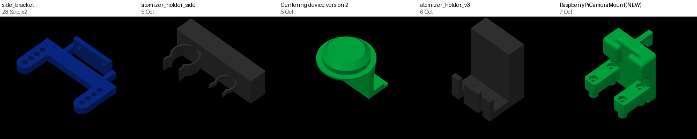

# What the A1 mini has printed (as of 2026-10-08)

> **Update, later on 2026-10-08:** the PLA set was sent to the A1 mini at 12:39 UTC, after this
> record was made. See [`../print_2026-10-08/`](../print_2026-10-08/README.md).

**None of the PiPER mount has been printed on the A1 mini**, and nothing of it is in the H2D's
cloud history either. Its job,
[`piper_camera_mount_A1mini_PLA.3mf`](../piper_camera_mount_A1mini_PLA.3mf), was never sent: it is
not in the account's cloud history, and no file of that name is on the printer's SD card. So the
whole set is still to print: bracket, pod, carrier, the four Pi 5 spacers and both tag wedges.

Read on 2026-10-08 at 11:30–11:50 UTC, asked for on
[PR #245](https://github.com/vertical-cloud-lab/byu-vcl/pull/245). The printer was idle
(`FINISH`, no error or HMS alert, heaters cold) and its camera showed an empty plate.

## Since 26 September

Times are lab time (MDT). "Est." is Bambu's estimate. All of these went through Bambu's cloud from
Bambu Studio, and all finished unless marked.

| Started | Job | Plate | Took / est. | Filament | What it is |
|---|---|---|---|---|---|
| 26 Sep 23:57 | `lid_mount_A1mini_PLA_fit_coupon` | 4 | 15 / 15 min | 2.5 g PLA, dark blue | OT-2 lid mount, fit coupon ([#234](https://github.com/vertical-cloud-lab/byu-vcl/pull/234)) |
| 28 Sep 18:37 | `side_bracket` | 1 | 56 / 57 min | 24.1 g PLA, dark blue | |
| 28 Sep 19:42 | `side_bracket` | 1 | 53 / 54 min | 23.6 g PLA, dark blue | the same part again |
| 29 Sep 12:44 | `lid_mount_drill_template` | 3 | 53 / 51 min | 31.8 g PLA, dark blue | OT-2 lid mount, drill template (#234) |
| 30 Sep 18:32 | `lid_mount_deck_plate2` | 2 | 70 / 69 min | 43.5 g PLA, dark blue | OT-2 lid mount, deck ([#84](https://github.com/vertical-cloud-lab/byu-vcl/pull/84)) |
| 2 Oct 12:56 | `lid_mount_base_plate1` | 1 | 146 / 150 min | 81.1 g PLA, black | OT-2 lid mount, base with posts (#234) |
| 5 Oct 11:15 | `atomizer_holder_side` | 1 | 18 / 19 min | 4.7 g PLA, black | atomizer |
| 5 Oct 14:58 | `Centering device version 2` | 1 | **failed or stopped after 1 min** | | |
| 5 Oct 15:01 | `Centering device version 2` | 1 | 68 / 69 min | 22.3 g PLA, black | powder doser, going by its first version (*Doser Centering Device*, 8 Sep) |
| 6 Oct 14:57 | `atomizer_holder_v3` | 1 | 56 / 62 min | 29.7 g PLA, black | atomizer |
| 7 Oct 15:28 | `RaspberryPiCameraMount(NEW)` | 1 | 32 / 33 min | 7.1 g PLA, black | one part, with supports: most likely Ben's edit of Cubware's CubXL camera mount ([#165](https://github.com/vertical-cloud-lab/byu-vcl/issues/165#issuecomment-6025948668)). It's 31.0 mm tall like that STL, and it was printed the afternoon its STEP was posted. **Not part of the PiPER mount** |

## Before that

The cloud history goes back to 13 July 2026: **52 prints, 46 finished and 6 failed or stopped**,
all in [`cloud_tasks_2026-10-08.json`](cloud_tasks_2026-10-08.json). Five of the six were sent again
straight away and finished. The one that wasn't, *Sensor package main enclosure* on 5 August,
ended after 2 minutes. July to mid-September is mostly powder-doser parts (vial caps, tip
racks, augers, the PCB housing), plus `picam3-mount-v2` (28–29 July, a Pi camera mount by its name).
None of it is the PiPER mount.

## How it was read

- **Bambu's cloud,** with [`cloud_history.py`](cloud_history.py). It gives each job's title, plate,
  start and end in UTC, estimate, filament and outcome. Logging in needs the e-mailed code that
  Bambu sends to every new machine, so a person relays it in the thread. The first code was
  rejected as expired when it was posted 10 min after it was sent, and the second worked 51 s
  after.
- **The printer's SD card** over LAN, with [`sd_card.py`](sd_card.py) through the CubXL Pi.
  - Every cloud job leaves its sliced 3MF in `/cache`; the table's part counts, weights and
    pictures come from those.
  - `/ipcam` has a camera recording of each print. Since 26 September, every recording lines up
    with a job above, so nothing ran that the cloud doesn't list.
  - The SD card root also has files uploaded over LAN, which the cloud never sees. These are the
    July–August powder-doser tests and `atomizer_holder_A1mini_blackPLA.gcode.3mf` (5 October).
    No recording matches the last one, so it wasn't printed from that file.
- **Not to be trusted:** the dates on the SD card's files. The printer's clock has been on
  UTC−6 and UTC+8. For example, the 2 October base print's files are dated 3 October 02:56.

Nothing was sent to the printer except two status requests (`pushall` and `get_version`). The rest
was FTPS reads and one camera frame. The cloud token stayed on the CI runner and was deleted at the
end of the session.
