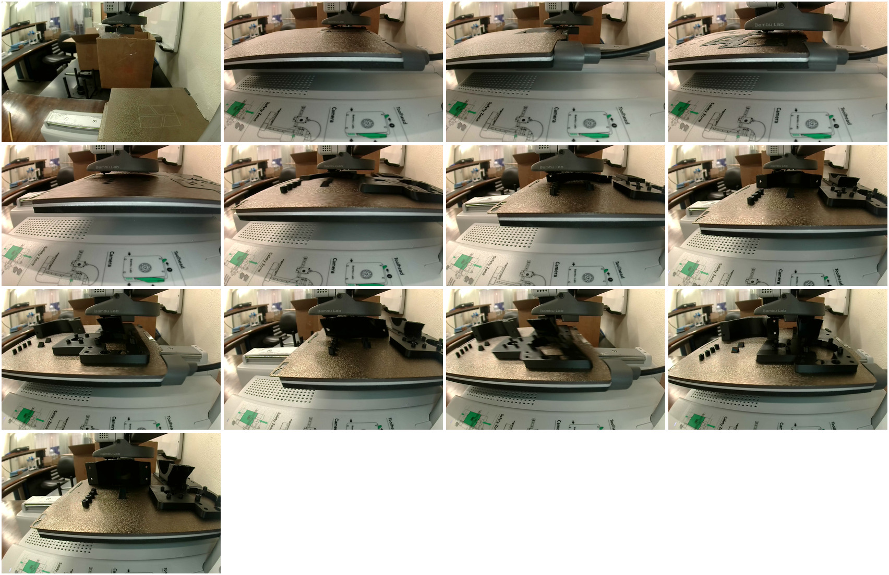

# The PiPER mount in PLA on the A1 mini (2026-10-08)

Every printed part of the mount on one plate:
- the bracket;
- the pod;
- the carrier;
- the four Pi 5 spacers;
- both tag wedges.

It went out in black Bambu PLA Basic on the Textured PEI plate, from
[`../piper_camera_mount_A1mini_PLA.3mf`](../piper_camera_mount_A1mini_PLA.3mf) as of `b3dba57`:
213 layers to 42.6 mm, 87.47 g, and Studio's estimate of 2 h 48 min 30 s. It was asked for on
[PR #245](https://github.com/vertical-cloud-lab/byu-vcl/pull/245) ("begin printing the parts").

This is the PLA set, for checking fits and putting the mount together. The FEA in the main README
puts printed PLA's ear roots anywhere from 0.16 to about 0.9 of first failure at snug, and favours
PAHT-CF on the H2D for the clamp in use.

**How it was sent.** Bambu Studio ran on the CI runner, logged in to the lab's Bambu account,
and sent the job through Bambu's cloud. This is route 3 of the
[runbook on PR #234](https://github.com/vertical-cloud-lab/byu-vcl/blob/claude/ot2-lid-camera-mount-20260925/bambu/README.md)
(`bambu/README.md` and `bambu/studio/README.md` on branch `claude/ot2-lid-camera-mount-20260925`),
followed step by step. It's the fifth print sent this way.

## Outcome

- Sent at 12:39:19 UTC; the first status read after it, at 12:39:57, found the printer `RUNNING` and heating.
- Layer 1 ran from 12:46:35 to about 12:54:10: 7.5 min, against the G-code's 7.
- **The session followed it to layer 153 of 213** (83 %) at 15:00, with no print error, HMS alert or
  temperature alarm. The frames checked (every 30 s through the first layers, then about every
  10 min) showed nothing wrong. The printer then gave 27 min to go, for a finish
  near 15:28 UTC. The session ended at 15:12, so this record stops before the finish.
- **Video:** https://www.youtube.com/watch?v=KPQpL98ouMU (unlisted, 5 min 21 s). It shows Studio's
  setup and slicing at 4×, then Send at 2×, then Studio's camera view at 60× to layer 101. The login
  is cut, and the room corners of the camera view are blurred.

## Timeline (UTC)

| Time | Step |
|---|---|
| 12:12:00 | Request |
| 12:16:14 | First read-only pre-flight: every automatic check passed, HUMAN-DECISION as always |
| 12:20:54 | Frame posted, go asked for |
| 12:21:01 | Recording and Bambu Studio started: certificate prompt, wizard, *Cancel* on the profile update, Beta prompts, plug-in |
| 12:24:50 | Plate sliced in the GUI, after the same three settings were set back (below) |
| 12:28:48 | *Log In* pressed; Bambu e-mails the code |
| 12:36:48 | Code posted with "Plate clear" (sgbaird); `wait_code.py` typed it 5 s later |
| 12:37:43 | Second pre-flight: the same scene, the same checks passing |
| 12:37:50 | The go: "Get going." (sgbaird) |
| 12:39:19 | *Send* |
| 12:39:57 | Status read: `RUNNING`, job `piper_camera_mount_A1mini_PLA`, heating |
| 12:46:35 | Layer 1 |
| 12:54:22 | Layer 2 |
| 13:46 | Layer 29: the carrier's plate has its solid top |
| 14:27 | Layer 101 |
| 14:33 | Layer 113 (67 %), 54 min to go by the printer |
| 15:00 | Layer 153 (83 %), 27 min to go: the last status this session committed |

## Files

| File | What |
|---|---|
| `20261008T121614Z_*` | First pre-flight: redacted status, checks and camera frame |
| `20261008T123743Z_*` | Second pre-flight, 1.5 min before Send |
| `sent/piper_camera_mount_A1mini_PLA.gcode.3mf` | The file Studio sent. It was exported mid-print with *File → Export → Export plate sliced file*, and its plate G-code is byte for byte Studio's own slice (MD5 `971c840fefd399638689a5460bf4da2b`). Only `DesignerUserId` is blanked |
| `print.json` | Settings restored in the GUI, Send options, estimates, timeline, the go |
| `watch.jsonl.gz` | Every status sample from `bambu_print.py watch` |
| `frames/` | Key frames from the printer's camera, named `<UTC>_L<layer>`, and `montage.jpg` of them all |

## What the GUI changed, and the check

On opening the CLI-sliced project, Studio reset the same three settings as on every earlier run:
- wall loops, 3 → 2;
- sparse infill density, 25 % → 15 %;
- circle compensation, on → off.

They were set back before slicing.

**The check.** The GUI's plate then matched the committed plate:
- 213 layers to Z 42.6;
- 87.47 g of filament (committed: 87.46 g);
- no layer's extrusion more than 0.46 mm of filament off (layer 5, out of 332 mm);
- the same bed (65 °C) and nozzle (220 °C) temperatures, start G-code (`M620 S0A`, `M412 S1`) and Z offset.

What differed:
- The config keys that differ are Bambu's stock acceleration limits (20000 / 20000 / 9000 against the project's 6000) and two infill keys that follow the infill value.
- The rest is metadata.
- The faster limits put Studio's estimate at 2 h 48 min 30 s, against the CLI's 2 h 50 min 29 s.

## Things the next print should know

- **The printer has moved** since the 29 September frames on PR #234. It now stands on a wooden
  counter by a whiteboard, with boxes behind it. The parked-high view shows a pencil, a red box and
  black rods near the bed.
- **A shorter go.** sgbaird gave the go as "Plate clear" with the login code, and called the rest of
  the runbook's checklist overkill: "Get going. Your other confirmation requests are overkill."
  Next time, ask for the code and "plate clear" in one message, and give anything else as
  information.
- **The clock.** This job was sent 27 min into the session. It runs about 2 h 49 min from Send, so it
  finishes about 16 min after the job's 180 min limit (15:12 UTC). Studio's Stop covers the print only while the
  session lasts. A print of this length needs Send within about 10 min of the trigger, or a
  hand-off.
- **Black PLA on the dark plate** shows in the low camera view only as a sheen until a part's
  outline is complete.
