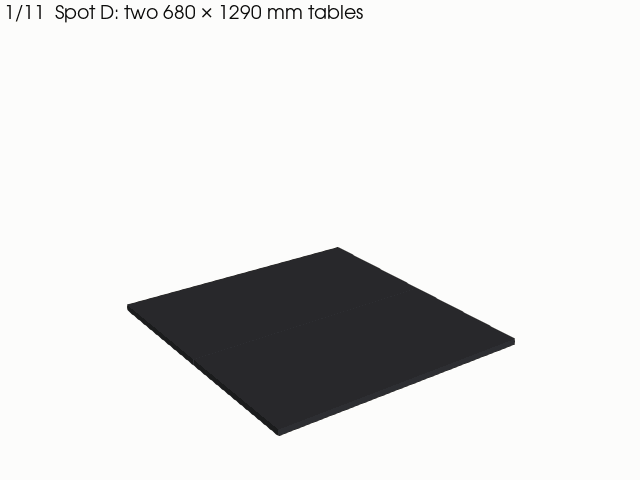
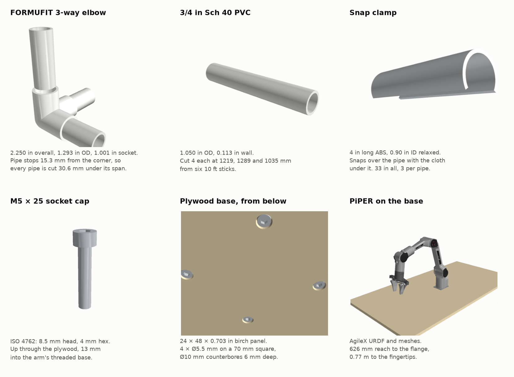

# Spot D enclosure model

A buildable model of the enclosure discussed in
[#229](https://github.com/vertical-cloud-lab/byu-vcl/issues/229), made from the parts in the
[25 Sept parts list](../README.md#parts). The frame is 3/4 in Sch 40 PVC with FORMUFIT
3-way elbows. It sits on the two-table top at spot D (1290 × 1360 mm) and stands 1.1 m tall.
The walls and top are canvas drop cloth, held on with snap clamps. The PiPER is bolted to a birch
plywood base in the middle of the table.

This is the "quarter-dome size" box from the parts list. The arm sits in the middle, not in a
corner, as suggested on 25 Sept: that keeps 93 % of its reach inside the walls, and its elbow
does not hit the back wall when it parks.



| File | What it is |
|---|---|
| [`cut-list.md`](cut-list.md) | Pipe cut lengths and stick plan, canvas panels, drilling, clamp count, and a priced shopping list |
| [`parts.py`](parts.py) | One function per part, built from the maker's published dimensions |
| [`build.py`](build.py) | Places every part, then writes the cut list and the exports below |
| [`animate.py`](animate.py) | Renders the parts sheet, the still and the assembly GIF |
| `dome-assembly.gif` | The assembly, step by step (640 × 480, 91 frames, renders in about 15 s) |
| `dome-finished.png` | The finished enclosure with the flap rolled up |
| `dome-parts.png` | Each part on its own, with the numbers it is built from |
| `models/*.stl` | Each part on its own, plus `enclosure-frame.stl` (frame, base and screws, no cloth). GitHub opens these in a 3D viewer. Units are mm |
| [`enclosure.glb`](enclosure.glb) | The whole thing in colour, with the arm and cloth. Open it in any glTF viewer, e.g. [gltf-viewer.donmccurdy.com](https://gltf-viewer.donmccurdy.com/) |

## Parts and the numbers they are built from



| Part | Numbers used | Source |
|---|---|---|
| 3/4 in Sch 40 PVC pipe | 1.050 in OD, 0.113 in wall | ASTM D1785, which Charlotte's pipe follows |
| FORMUFIT F0343WE 3-way elbow | 2.250 in overall on each axis, 1.293 in OD, 1.050 in socket, 1.001 in insertion depth | [FORMUFIT spec sheet](https://assets.formufit.com/tsd/TSD-F0343WE.pdf) |
| Snap clamp, 3/4 in PVC | 4 in long, 0.90 in ID relaxed, ABS | [Johnny's #7036](https://www.johnnyseeds.com/tools-supplies/greenhouse-and-tunnel-supplies/hardware-accessories/snap-clamps-for-3-4%22-pvc-or-1%22-emt-7036.html) |
| M5 × 25 socket cap screw | 8.5 mm head, 5 mm tall, 4 mm hex | ISO 4762 |
| PureBond birch panel | 24 × 48 in, 0.703 in actual thickness | Columbia Forest Products |
| Canvas drop cloth | Sold as 9 × 12 ft, 8 ft 9 in × 11 ft 9 in finished | Everbilt |
| PiPER arm and gripper | AgileX's own URDF and meshes | [`piper_ros`](https://github.com/agilexrobotics/piper_ros) at `ac41fcb`, via [`../piper_fk.py`](../piper_fk.py) |

Two of these are estimates: the snap clamp's wall thickness and the width of its gap. The PiPER
manual gives the base as four M5 holes on a 70 mm square. The model assumes that square is centred
on the base joint, so trace the real base before drilling.

**The cut allowance comes from the elbow.** A pipe stops 15.3 mm (0.603 in) short of the corner
inside each elbow, so every pipe is cut 30.6 mm shorter than its centre-to-centre span. The cut
lengths are 48, 50 3/4 and 40 3/4 in (1219, 1289 and 1035 mm), four of each, out of six 10 ft
sticks.

## Assembly

The steps match the GIF.

1. Put the second table next to the first, which gives a 1290 × 1360 mm top.
2. Drill the plywood: four 5.5 mm holes on a 70 mm square at its centre, with 10 mm counterbores
   6 mm deep from underneath.
3. Bolt the arm on with four M5 × 25 screws from below, with the base held off the table.
4. Set the base in the middle of the table, long side running front to back.
5. Push the bottom rectangle together: four elbows, two 1219 mm pipes and two 1289 mm pipes.
6. Push the four 1035 mm corner posts into the bottom elbows.
7. Add the top rectangle, the same as the bottom one.
8. Lay the top cloth on and snap it to the four top rails.
9. Hang the back and side walls. Snap them to the corner posts and the bottom rails.
10. Hang the front flap from the front top rail only.
11. Roll the flap up to load. The arm works inside the walls.

Dry-fit everything before gluing. Press-fit joints are enough to carry cloth.

## Clearances

- **Height:** the frame is 1098 mm tall outside the fittings. The fingertip tops out 0.89 m above
  the base, which is 0.91 m above the table, so it clears the top rails by about 0.16 m.
- **Walls:** the frame is 1283 × 1352 mm outside. At full stretch the fingertip reaches 0.77 m, so
  low down it can still touch the cloth, by up to about 12 cm (see [`../README.md`](../README.md#reach)).
  That is a job for soft walls, or for joint limits in the SDK.

## Not in the model

- **Fixing the base to the table.** The 25 Sept list includes four 4 in C-clamps. At D, though,
  the back edge of the table is against the wall. A C-clamp also needs about 85 mm of clear space
  under the table top to reach the plywood, and the table at D has a cabinet under it. Check the
  second table before buying clamps. If it has no overhang, a sheet of non-slip mat under the
  plywood is the fallback.
- **Cable routing.** The PiPER's cable leaves the back of the base. It can exit under the back wall.

## Regenerating

```bash
python build.py                    # cut-list.md, models/, enclosure.glb
xvfb-run -a python animate.py      # dome-parts.png, dome-finished.png, dome-assembly.gif
```

Needs numpy, trimesh, manifold3d, shapely, pyvista and pillow. `piper_fk.py` fetches the PiPER URDF
into `/tmp` the first time.
