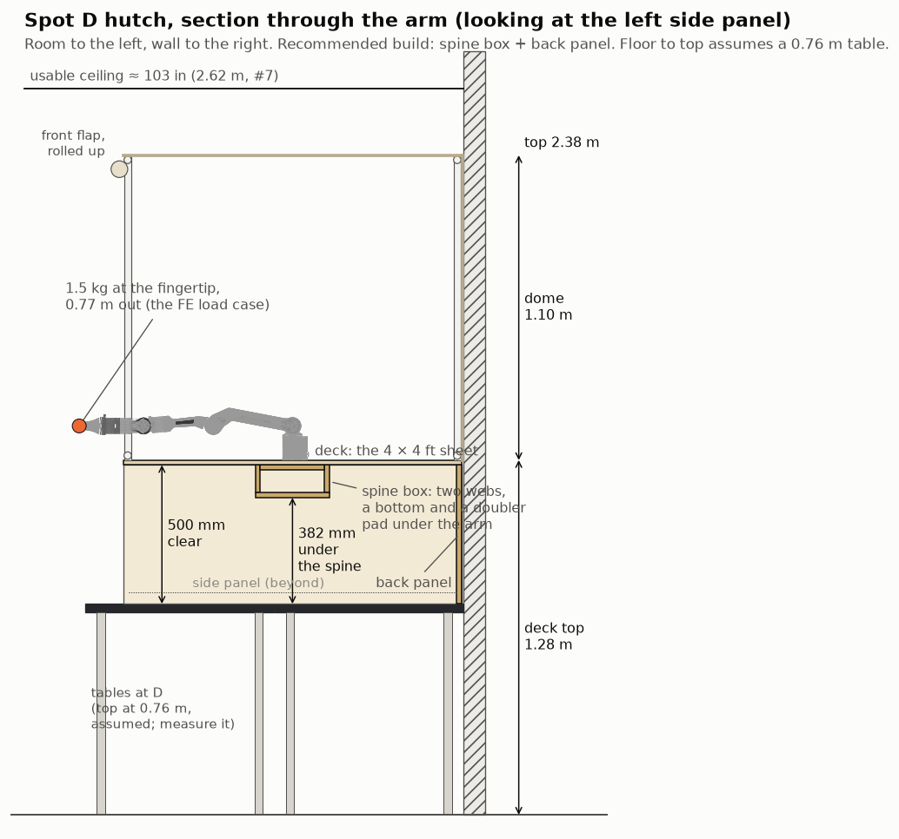
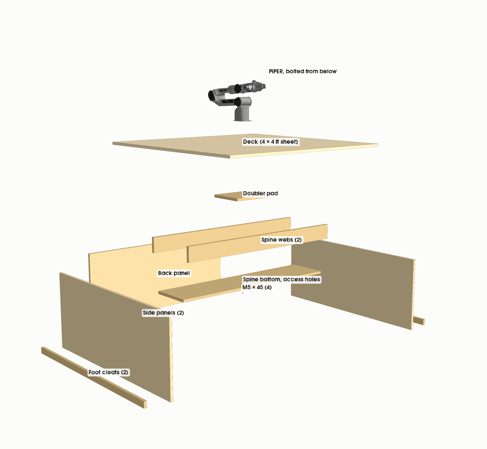
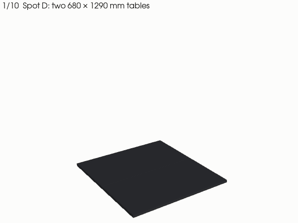
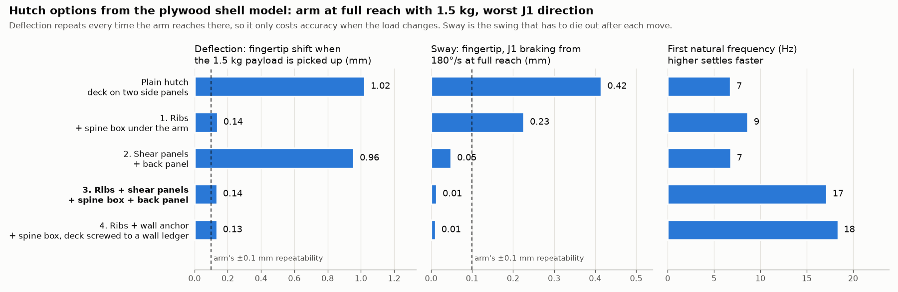

# Raised deck (hutch) at spot D

The two-level idea from [#229](https://github.com/vertical-cloud-lab/byu-vcl/issues/229): a plywood
hutch on the two tables at spot D, with 0.5 m of open workspace underneath. The PiPER is bolted
upright in the middle of the deck, and the dome from [`../dome`](../dome) stands on the deck.







## The sheet makes the deck, and nothing else

For the dome to stand on the deck, the deck has to be about the dome's size. The 4 × 4 ft sheet
is exactly that, at 1219 mm square, so it becomes the deck with nothing left over. The dome's
eight rails are recut to 45 1/2 in, so its outside matches the deck (the posts stay at 40 3/4 in).

Everything under the deck comes out of **one more 4 × 8 ft sheet of 3/4 in plywood**, or two
4 × 4 halves. Two of those parts, the back panel and the spine, can't be replaced by 2×4s. A 2×4
frame racks unless it is braced or sheathed, and the spine works because it is a closed box. See
[`cut-list.md`](cut-list.md) for the parts, the [sheet layout](sheet-layout.png), the dome rails
and the hardware. If the arm's current base is the other half of the sheet you have, it is freed
when the arm moves up and can supply the second half of the cut list.

## Options compared

Each option is meshed as plywood shells in OpenSees ([`fea.py`](fea.py)). It is loaded with the
arm stretched out horizontally (fingertip 0.77 m from the base axis) holding 1.5 kg, turned to
whichever J1 direction is worst. All options share the deck and two full-depth side panels.



| Option | Payload deflection | Total static | Lift (J2) | Sway (J1) | 1st mode | Plywood |
|---|---|---|---|---|---|---|
| Plain hutch: deck on two side panels | 1.02 mm | 2.29 mm | 3.01 mm | 0.42 mm | 7 Hz | 29 kg |
| 1. Ribs: + spine box under the arm | 0.14 mm | 0.29 mm | 0.39 mm | 0.23 mm | 9 Hz | 36 kg |
| 2. Shear panels: + back panel | 0.96 mm | 2.18 mm | 2.86 mm | 0.05 mm | 7 Hz | 35 kg |
| **3. Ribs + shear panels** | **0.14 mm** | **0.29 mm** | **0.38 mm** | **0.01 mm** | **17 Hz** | **42 kg** |
| 4. Ribs + wall anchor (no back panel) | 0.14 mm | 0.29 mm | 0.38 mm | 0.01 mm | 18 Hz | 36 kg |

All of these are movements of the fingertip, caused by the structure flexing (the arm itself is
treated as rigid):

- **Payload deflection:** how far the fingertip moves when the 1.5 kg is picked up. It is what
  costs accuracy, since the arm lands somewhere slightly different holding the part than empty.
- **Total static:** the arm's own weight plus the payload. It is the same every time the arm
  goes to that pose, so it costs absolute accuracy but not repeatability.
- **Lift:** J2 raising the stretched arm at the SDK's 5 rad/s² cap.
- **Sway:** the sideways swing while J1 brakes from its rated 180°/s at 5 rad/s². This is the
  motion that has to die out after each move.
- **1st mode:** a higher frequency settles faster.

The arm's own repeatability is ±0.1 mm.

## Recommendation: option 3, spine box plus back panel

The two additions fix different problems, and each does almost nothing for the other's:

- **The spine fixes deflection.** It is a closed box (two webs, a bottom and a doubler pad)
  running under the arm from one side panel to the other. The arm's moment goes into the box
  and straight out to the side panels, which stand over the table legs. Without it, the bare
  deck dishes under the arm. The 23 N·m of the stretched arm tilts it by 2.4 mrad, which is
  1.9 mm at the fingertip, 1 mm of it from the payload alone. The spine cuts that sevenfold and takes the
  sag under the arm from 0.39 mm to 0.02 mm.
- **The back panel fixes sway.** Left-right sway is the hutch racking, and the back panel is the
  only thing that stops it: the foot's sway drops from 0.18 mm to 0.003 mm. The side panels
  already handle front-to-back.
- **Together** they lift the first mode from 7 Hz to 17 Hz, so what little sway is left also
  dies out faster.

Option 4 (the wall anchor) performs the same as option 3 in the model, saves the back panel, and
needs anchors drilled into the block wall, which is a facilities question. Hold it in reserve:
the model assumes the tables are rigid, and the wall anchor is the only option that takes the
sideways load out of the tables. If the tables turn out to wobble, that is the fix.

**What is left (0.14 mm):** almost all of it is the deck rocking locally under the arm's
roughly 100 mm foot. It scales with payload times reach. A 50 g vial at 0.5 m moves the
fingertip by about 2 µm. Two variants were tried on option 3 (`python fea.py variants`, not in
the table):

- A deeper spine (150 mm) gets it to 0.12 mm.
- A stiff 200 mm square adapter plate under the foot gets it to 0.08 mm. The model treats the
  plate as rigid, so in practice that means something like 1 in aluminium plate.

Neither is needed unless full-reach, full-payload accuracy matters.

## Loads at the arm's foot

From [`loads.py`](loads.py). Masses come from AgileX's `piper_description.urdf` (4.17 kg arm,
0.50 kg gripper), with 1.5 kg at the fingertip, 0.77 m out at shoulder height.

| Case | Down | Tipping moment | Sideways | Twist |
|---|---|---|---|---|
| Holding still | 60.5 N | 23.1 N·m (11.3 from the payload) | | |
| J1 braking from 180°/s at 5 rad/s² | 60.5 N | 26.0 N·m | 26.1 N | 7.9 N·m |
| J2 lifting at 5 rad/s² | 72.3 N | 31.0 N·m | | |

## Build sequence

1. **Cut** the second sheet as in [`sheet-layout.png`](sheet-layout.png). Drill the deck (4 × Ø5.5
   mm on a 70 mm square at its centre), the pad (the same, with Ø10 mm counterbores from below)
   and the spine bottom (4 × Ø25 mm access holes under the screws). Mark the hole square from the
   arm itself.
2. **Build the deck upside down** on the floor. Glue and screw the pad to the deck's underside,
   holes aligned. Then glue and screw the two webs either side of it, at 125 mm either side of
   the centre line, and the spine bottom across them. This is now a torsion box. Let it cure.
3. **Make the U**: glue and screw the back panel between the two side panels, square. Screw a
   foot cleat along the outside foot of each side panel.
4. **Set the U on the tables**, back against the wall, so the side panels sit over the table ends.
   Clamp each foot cleat to the table end with two C-clamps. Check first that the table tops overhang
   their frames enough to take a clamp.
5. **Drop the deck on**, spine down and running left to right. Glue it and screw it down into
   the sides and back every 150 mm. Then drive screws through each side panel into the spine
   ends.
6. **Bolt the arm** through the deck and pad with four M5 × 45 socket caps, from below through the
   access holes. Its cable exits to the back.
7. **Stand the dome frame** on the deck (rails recut to 45 1/2 in) and clamp the canvas on as
   before.

**Glue every joint.** The model assumes glued joints. With screws alone, the panels can slip at the
joints, and the hutch would be floppier by an amount the model can't predict.

## Assumptions

- **Plywood:** 3/4 in hardwood-faced veneer core, 17.9 mm actual. E = 7.0 GPa along the face
  grain and 4.0 GPa across it, in-plane shear G = 0.45 GPa, rolling shear 0.10 GPa, density
  600 kg/m³. These are conservative middle values for domestic birch-faced panel. Real panels
  vary by ±30 %, and the deflections scale inversely with these values.
- **Joints and supports:** joints are glued, so panels share edges rigidly. The feet are pinned to
  the table top, and the **tables are rigid**: their own sway adds to the sway numbers, unless the
  hutch is anchored to the wall. The arm's foot is a rigid 100 mm square.
- **Loads:** the payload is a point mass at the fingertip, 140 mm past the flange. Speeds are
  J1's rated 180°/s and the SDK's acceleration ceiling of 5 rad/s² (`JointConfig.max_joint_acc`
  is 0–500 in 0.01 rad/s²).
- **Natural frequency:** the deck is treated as a rigid body on the hutch's stiffness at the foot.
  On it ride the arm at full reach, the deck, the spine, 7 kg of dome on the rim and a third of
  each panel. That under-counts the rocking frequency a little.
- **Not modelled:** creep, humidity, screw slip and the PVC dome's own sway. Creep matters, because
  plywood under a constant load keeps sagging for months. Re-check taught positions after the
  first few weeks.
- **Tables:** two 680 × 1290 mm tables, back edge against the wall, top 0.76 m from the floor (not
  measured). The hutch is pushed back against the wall, so 140 mm of table top is left in front
  of it.

## Heights, reach and safety

- **Heights:** the deck top is 518 mm above the tables. The spine hangs 118 mm below the deck's underside, so
  the clear height is 500 mm everywhere except a 268 mm wide strip under the arm, where it is
  382 mm. With a 0.76 m table, the deck sits at 1.28 m and the dome top at 2.38 m (2.53 m with a
  0.91 m bench), under the 2.62 m measured in #7. If the room has sprinklers, though, 18 in of
  clearance below the heads would put the limit at about 2.16 m.
- **Reach outside the walls:** the smaller dome lets more of the reach out, **14 % instead of 7 %**.
  At full stretch, the fingertip passes the walls by up to 0.16 m, and toward the back that means
  the block wall.
- **The workspace below is within reach.** Past the deck's front edge, the fingertip can drop
  0.26 m below the deck, into the top of the opening where people will be working. **A software
  keep-in box at the deck's edges is not optional for this layout.** The SDK has no Cartesian
  limits, so it goes in our motion code (see [`../README.md`](../README.md#keeping-it-inside-the-enclosure)).
- **Weight:** the plywood is about 42 kg. With the dome and the arm, about 54 kg sits on the
  tables.
- **Transformer:** the hutch stays inside the tables' footprint, so it adds nothing near the
  high-voltage transformer that Gage flagged.

## Files

| File | What it is |
|---|---|
| [`hutch.py`](hutch.py) | Dimensions, material values and the five options |
| [`loads.py`](loads.py) | The arm's loads on the deck |
| [`fea.py`](fea.py) | The shell model; writes `fea-results.json` and `fea-shapes.npz` |
| [`build.py`](build.py) | Places every part, writes `cut-list.md`, `models/*.stl` and `hutch.glb` |
| [`render.py`](render.py) | The figures and the GIF |
| `models/*.stl` | One STL per plywood part, plus `hutch.stl` (the whole hutch). Units are mm |
| [`hutch.glb`](hutch.glb) | Tables, hutch, dome and arm, in colour |
| `hutch-finished.png` | The finished enclosure with the flap rolled up |

```bash
python fea.py                      # about 2 minutes
python build.py
xvfb-run -a python render.py       # about 30 s
```

These need numpy, scipy, trimesh, manifold3d, shapely, pyvista, pycollada, matplotlib, pillow
and openseespy. `../piper_fk.py` fetches the PiPER URDF into `/tmp` the first time.
