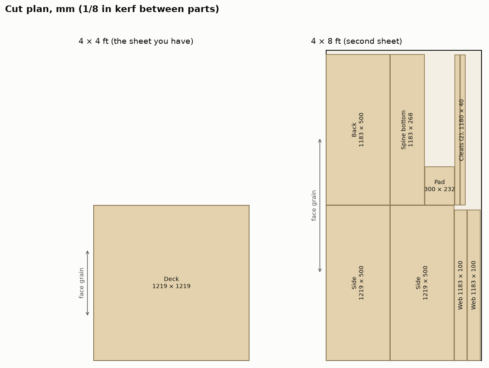

# Raised deck (hutch) at spot D: cut list

Generated by `build.py` for the recommended build (spine box and back panel). All parts are
3/4 in plywood, 17.9 mm (0.703 in) actual. Lengths run along the face grain.

## Plywood

| Part | Length (along grain) | Width | Qty | From | Notes |
|---|---|---|---|---|---|
| Deck | 1219 mm (48 in) | 1219 mm (48 in) | 1 | 4 × 4 ft | grain left to right; 4 × Ø5.5 mm at the centre on a 70 mm square |
| Side panel | 1219 mm (48 in) | 500 mm (19 5/8 in) | 2 | 4 × 8 ft | grain front to back |
| Spine web | 1183 mm (46 5/8 in) | 100 mm (3 7/8 in) | 2 | 4 × 8 ft | grain along the length |
| Back panel | 1183 mm (46 5/8 in) | 500 mm (19 5/8 in) | 1 | 4 × 8 ft | grain left to right |
| Spine bottom | 1183 mm (46 5/8 in) | 268 mm (10 1/2 in) | 1 | 4 × 8 ft | 4 × Ø25 mm access holes under the arm's screws |
| Doubler pad | 300 mm (11 3/4 in) | 232 mm (9 1/8 in) | 1 | 4 × 8 ft | 4 × Ø5.5 mm, Ø10 mm counterbores 6 mm deep from below |
| Foot cleat | 1180 mm (46 1/2 in) | 40 mm (1 5/8 in) | 2 | 4 × 8 ft | from the offcut |

- **Sheet 1** is the 4 × 4 ft sheet you have. It becomes the deck, whole.
- **Sheet 2** is one more 4 × 8 ft sheet of the same 3/4 in plywood, grain along the 8 ft. Crosscut it
  at 48 in first. The first half gives both sides and both webs, with a 10 mm strip left over.
  The second half gives the back, the spine bottom, the pad and both cleats, with a
  126 × 1216 mm offcut left over.
- Two 4 × 4 ft halves work just as well as one 4 × 8. If the arm's current base is the other half of the
  sheet you already cut, it is freed when the arm moves up to the deck, and it can supply the second half.

## Dome rails

The dome frame stands on the deck, so its eight rails are recut. The posts do not change.

| Member | Qty | Cut length | Was |
|---|---|---|---|
| Front, back and side rails, top and bottom | 8 | **1156 mm (45 1/2 in)** | 48 in and 50 3/4 in |
| Corner posts | 4 | 1035 mm (40 3/4 in) | the same |

Outside of the fittings, the frame is now 1219 × 1219 × 1098 mm, the same as the deck. If the rails are already cut to the old lengths,
trim them. Every rail is now the same length, so the frame can go together either way round.

## Hardware

| Item | Qty | Where |
|---|---|---|
| Wood glue (PVA, e.g. Titebond II) | 1 bottle | every plywood joint |
| #8 × 1 1/2 in wood screws | about 60 | deck into sides, back and webs every 150 mm; through the sides into the web and back ends; spine bottom into the webs |
| M5 × 45 mm socket cap screws | 4 | the arm, up through the pad and deck |
| 4 in C-clamps | 4 | the foot cleats to the table ends |

An M5 × 45 reaches 15 mm into the arm's base. Check the depth of its threaded holes first.
