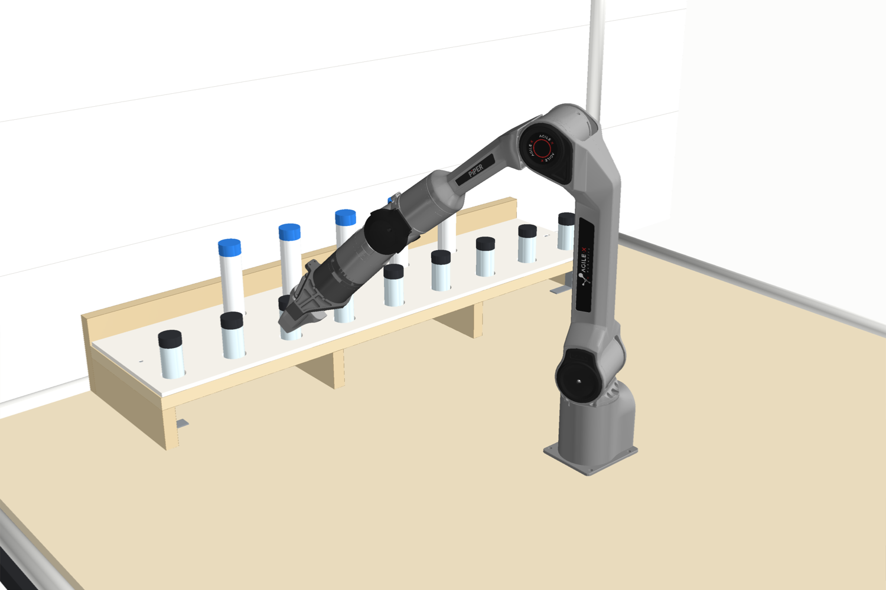
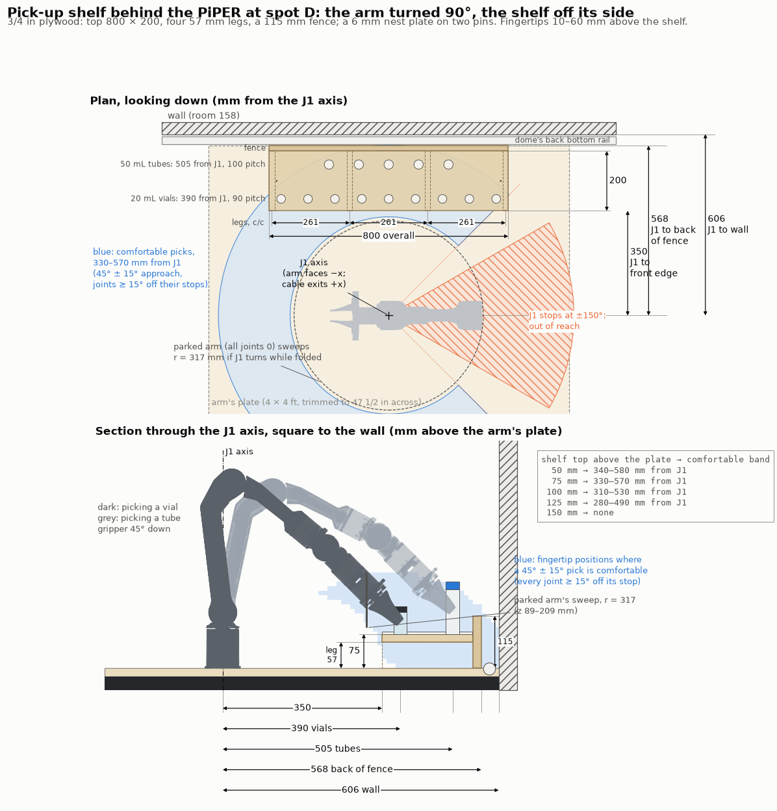

# Pick-up shelf for the PiPER at spot D

A low plywood shelf along the back of the table for the arm to pick from, as sketched in
[#229](https://github.com/vertical-cloud-lab/byu-vcl/issues/229). It is modelled on the spot D table, inside the
[dome](../dome/), with the arm on its plywood plate.





## Recommendation

**Turn the arm 90° so it faces along the wall.** In the model it faces left (−x), so its cable leaves
to the right, which matches the photo. The shelf is then off the arm's side (J1 ≈ −90°), not behind it.

The reason is J1. It stops at ±150°, so a 60° wedge straight behind the base is out of reach, or a
90° wedge if you keep 15° off the stop. Leaning back over the shoulder doesn't help either. Behind the
base, at shelf height and 330–570 mm back, there is no gripper angle that works, even right at the joint
stops. With the arm facing the room and this shelf behind it, 5 of the 9 vial pockets and all 5 tube
pockets are past J1's stop.

| | Value | Why |
|---|---|---|
| J1 axis to shelf front edge | **350 mm** | The parked arm (all joints at 0) sweeps 317 mm round J1 if J1 turns while it is folded. That leaves 33 mm. Its elbow joint sits 282 mm behind J1, and the arm's outside is at 314 mm |
| Shelf depth | **200 mm** to the fence | Items 390–505 mm from J1, inside the 330–570 mm comfortable band |
| Shelf top above the arm's plate | **75 mm** (57 mm legs under the 18 mm top). No more than 100 mm | Lower is better (see the table below). At 150 mm nothing on the shelf is comfortable |
| Length | **800 mm**, centred on J1 | Front-row pockets run from −360 to +360 mm. The worst is J1 at −133°, which is 17° off the stop. Back-row pockets run from −200 to +200 mm |
| J1 to back of fence | 568 mm | The fence stands 5 mm in front of the dome's back bottom rail |
| J1 to wall | 606 mm | That puts the arm 74 mm toward the wall from the table's centre line |

**What counts as comfortable.** The gripper can come in at any angle from 30° to 60° below horizontal,
so 45° with 15° of slack either way. Every joint has to stay at least 15° off its URDF limit. Fingertip heights
run from 10 to 60 mm above the shelf, which covers gripping a short item low and a tall one higher up.
All 14 pockets pass ([`shelf-results.json`](shelf-results.json), `items_comfortable`).

**Why 45° and not straight down.** The PiPER's wrist (J5) only bends ±70°. With 15° margins, straight-down
picks only work with the fingertips within about 50 mm of the arm's plate. Any raised shelf therefore means
angled picks. At 45°, the fingers close sideways around an upright vial or tube just as they would from above.

| Shelf top above the plate | Comfortable band, from J1 |
|---|---|
| 50 mm | 340–580 mm |
| **75 mm** | **330–570 mm** |
| 100 mm | 310–530 mm |
| 125 mm | 280–490 mm |
| 150 mm | none |

## Making item positions repeatable

1. **Put the shelf on the arm's own plate and fix it there.** Two 1/4 in steel dowels go up into the end
   legs and down into the plate. Mark the plate holes from the legs with dowel centres, so they line up.
   The dowels set where the shelf sits.
   Four corner braces hold it down. Unfixed, the shelf would slide under about 18 N, which is roughly what
   the arm can push with, so it has to be pinned and screwed. Arm and shelf on one plate also means
   nothing changes if the plate shifts on the table.
2. **Nest plate on two pins.** This is a 6 mm hardboard or acrylic plate with through-pockets 1 mm bigger
   than each item, each with a 1.5 mm × 45° lead-in. It sits on two 6 mm pins in the shelf top: a round
   hole on the left fixes its position, and a slot on the right fixes its rotation without fighting the first pin. An item
   placed up to 1.5 mm off still drops into its pocket, and the gripper's 70 mm stroke gives several mm of
   capture when picking.
3. **Load the plate, not the shelf.** The shelf front is about 1.1 m from the table's front edge, which is
   a long reach through the flap. Instead, lift the plate off its pins, fill it at the bench, and drop it back.
   A second plate cut for different items swaps in the same way.
4. **Teach on the real arm.** Record each pocket by jogging the arm to it once, rather than trusting the CAD.
   The fence gives a straight backstop for anything square, such as a well plate.
5. **Optional:** an AprilTag at each end of the plate lets the wrist camera check the shelf hasn't moved.

## How stiff it needs to be

Aim for **≤ 0.1 mm** of movement at any pocket under the items plus the arm pressing on one. That is the
arm's own repeatability, so the shelf needs at least 200 N/mm for a 20 N press. Beam estimates
(E = 7 GPa along the grain, the hutch's value):

| | Sag at a pocket | Stiffness |
|---|---|---|
| **4 legs** (261 mm apart), 3 kg of items + a 20 N press | **0.014 mm** (0.018 mm after creep) | ~1,800 N/mm |
| Only the 2 end legs | 0.57 mm | ~67 N/mm |

- **The middle legs are what make it stiff enough.**
- **The shelf won't shift.** The legs and fence are plywood panels 200 and 800 mm wide, so the shelf itself
  doesn't rack measurably. What matters is the pins and braces into the plate.
- **Humidity is the biggest effect.** Plywood grows and shrinks about 0.01–0.02 % per 1 % change in moisture
  content. A 3 % seasonal swing moves the far pockets about 0.25 mm relative to J1. That is within the
  lead-in, but re-check the taught positions every few months, or let the tags do it.

## On the raised deck

It works there too, with less change than on the table:

- **The arm stays where the hutch puts it**, in the middle of the deck. That is 610 mm from the deck's back
  edge, and the shelf needs 568 mm. With the dome's back rail on the deck, that leaves 12 mm between
  the fence and the rail. The spine and pad don't change. Turn the arm 90° the same way. The hutch's FE model
  already used the worst J1 direction, so its numbers stand.
- **The shelf's load goes straight down the hutch's back panel**, since the shelf sits right over it.
- **No separate plate:** the shelf's dowels and braces go straight into the deck, and nothing needs trimming.
- **Plywood:** on the table, the shelf comes out of any 318 × 1003 mm offcut. Don't take it from the
  leftover 4 × 4 if you might still build the hutch, because the deck is that sheet, whole. On the deck, the
  hutch's 126 × 1216 mm offcut gives the legs and fence, and the 200 mm top needs another piece (a 2 × 4 ft project
  panel is plenty).
- **Loading:** the shelf top is about 1.35 m off the floor (assuming a 0.76 m table), about 0.96 m in
  from the deck's front edge. Lifting the nest plate out matters even more here.

## Cut list

[`cut-list.md`](cut-list.md) gives the plywood parts, the nest plate and its pockets, the hardware, and where to drill
the plate. The plywood is one top (800 × 200), four legs (200 × 57), and one fence (800 × 115), all 3/4 in.

## Assumptions

- **The arm's plate is the 4 × 4 ft half sheet in the photo.** It is trimmed to 47 1/2 in across: at 48 in it
  is 2 mm too wide to drop between the dome's corner elbows (1217 mm apart inside). If the dome isn't
  going on the table, the shelf can sit 5 mm off the wall instead, putting J1 573 mm from it.
- **Items:** 20 mL scintillation vials (28 × 61 mm) and 50 mL self-standing tubes (30 × 115 mm). Only the
  pockets depend on these. Swap in the real items.
- **Reach:**
  - It comes from AgileX's URDF, with its joint limits (the SDK defaults: J1 ±150°, J5 ±70°).
  - The fingertip is 140 mm past the flange.
  - J4 is held at 0, so the arm works in a plane. Rolling J4 and bending J5 sideways can reach a little
    further, but only with the wrist near its stops.
- **Stiffness:**
  - Plywood spans are treated as simply supported, which is conservative: the top is continuous and glued to the fence.
  - Plywood on plywood friction is μ = 0.3.
  - The 3 kg of items and the 20 N press are guesses at the worst case.
- **The dome on the table is the one in [`../dome`](../dome/)**. Its back bottom rail runs along the wall.

## Files

| File | What it is |
|---|---|
| [`reach.py`](reach.py) | Maps where a 45° pick is comfortable and measures the parked pose from the meshes. Writes [`reach-results.json`](reach-results.json) and `reach-map.npz` |
| [`build.py`](build.py) | Places the shelf, checks every pocket against the map, and sizes the legs. Writes [`shelf-results.json`](shelf-results.json), [`cut-list.md`](cut-list.md), `models/*.stl` and `shelf.glb` |
| [`render.py`](render.py) | `shelf-3d.png` and `shelf-drawing.png` |
| `models/*.stl` | Each part, and `shelf.stl` for the whole shelf. They are in the arm's frame: the origin is on J1 at the top of the plate, +y is toward the wall, and the units are mm |
| [`shelf.glb`](shelf.glb) | The table, plate, shelf, items, the dome frame (no cloth) and the arm picking a vial, in colour |

```bash
python reach.py && python build.py && xvfb-run -a python render.py
```

Needs numpy, scipy, matplotlib, trimesh, manifold3d, shapely, pyvista, pycollada and pillow. `../piper_fk.py`
fetches the PiPER URDF into `/tmp` the first time.
